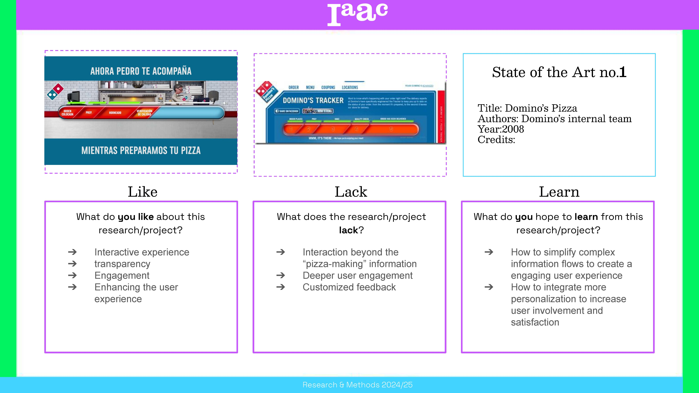
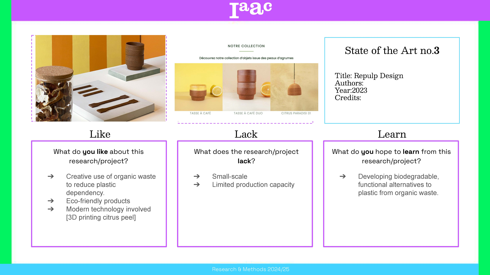
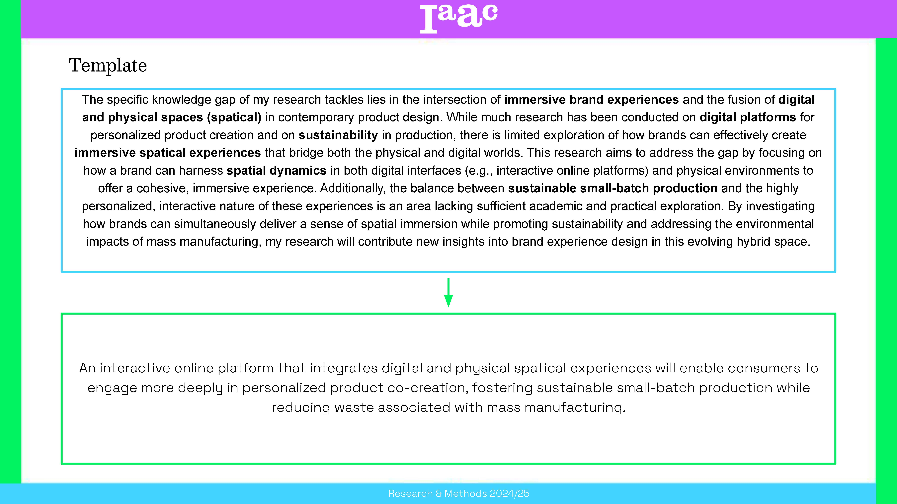
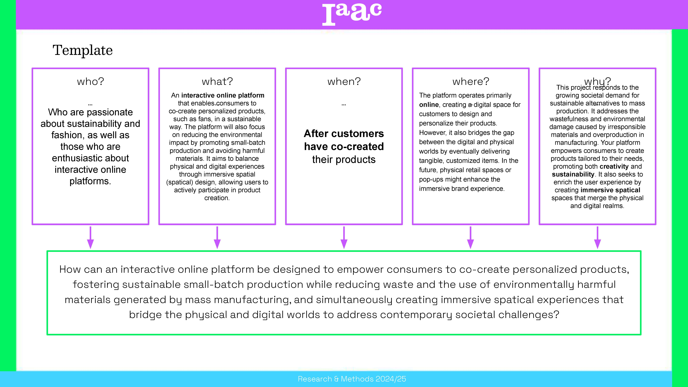
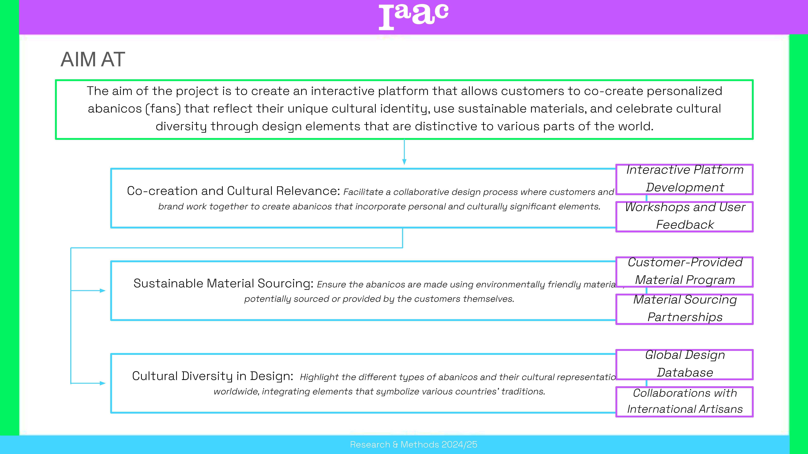

---
hide:
    - toc
---

!!! info "Research & Methods Workshop"
    ==FACULTY==: Mathide M./ Fiona D./ Nikol K.
    
    ==CALENDAR==: 15/10/2024 - 18/10/2024

    ==TRACK==: Reflection

!!! quote

    # Methods are the tools; research is the journey; understanding is the destination.
    
    
!!! abstract "Notes"
    - Contextualising
	* Background/framework[Understanding the start point]
	* Quantitative[Limitation]
    * Analysis of NEEDS
    * Purpose of Study[Why/What]
    
    !!! note ""
        The Research & Methods Course offers itself as a platform oriented to the learning, understanding and application of specific research and experimental skills to develop and manage research processes and content. The course follows the learning by doing methodology applied at IAAC, whereby students test the research skills acquired through the course within the context of their individual thesis agenda.

        ## Below are the exercises we did during the seminar.

        

        {: style="height:400px;width:650px"}

        {: style="height:400px;width:650px"}

        {: style="height:400px;width:650px"}

        {: style="height:400px;width:650px"}

        {: style="height:400px;width:650px"}

        {: style="height:400px;width:650px"}

        {: style="height:400px;width:650px"}

        {: style="height:400px;width:650px"}

        {: style="height:400px;width:650px"}

        {: style="height:400px;width:650px"}

!!! example "Reflection"
    I really liked this seminar. It helped me a lot with rethinking and replanning my project. By doing the exercises and talking to different instructors during class time, I gained better insight and analysis of my work.

    Although the classroom, which was in the main hall, was organized a bit hastily and the attendance system was too strict, it was understandable since there were many students attending at the same time. Other than that, it was an amazing course.

    I can't wait for the next two seminars in the upcoming terms. I believe they will help me even more with my thesis project.