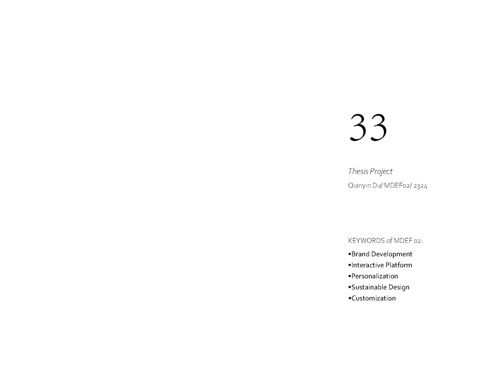
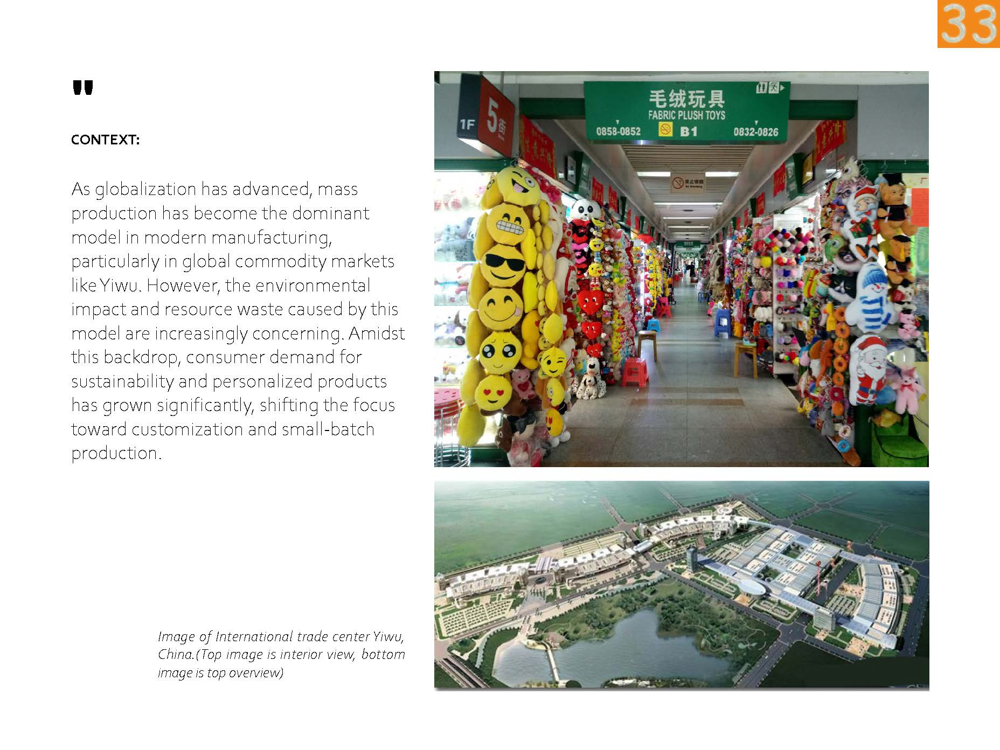
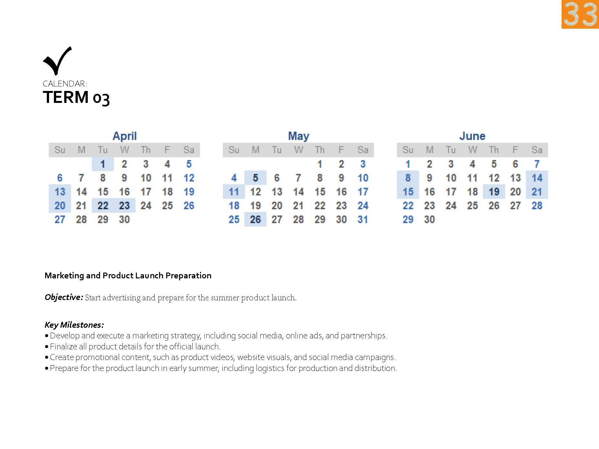
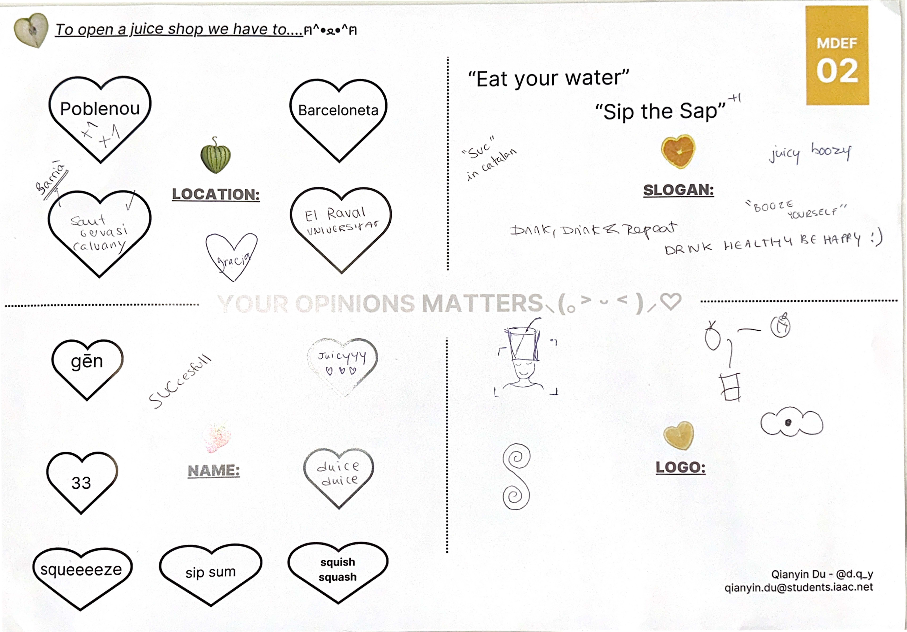

---
hide:
    - toc
---

!!! info "Thesis Project"
    ==FACULTY==: Jana Tothill Calvo/ Roger Guilemany/
    
    ==CALENDAR==: 07/10/2024 - 03/12/2024

    ==TRACK==: Reflection

!!! quote

    # Opportunities don't happen. You create them.😉
    
    
!!! abstract "Notes"
    > At the beginning of the academic year, I was captivated by the abanico (hand fan) and its blend of functionality, fashion, and cultural heritage. Living in Barcelona, where summers are hot and air conditioning is uncommon, I saw the abanico as a sustainable and stylish solution to beat the heat. This sparked my interest in exploring personalization, cultural relevance, and sustainable materials through interactive design.

    

    

    

    

    

    

    

    

    

    

!!! example "Design Dialogues"
    > As my project evolved, I found myself drawn to the idea of launching a juice shop as a real business. This new direction allows me to combine my interest in sustainability and design innovation with a practical, customer-oriented concept. The juice shop provides a platform where the abanico can be integrated in creative and meaningful ways. For example, I could use natural waste from the juice-making process to create natural dyes for the abanico fabrics. Additionally, recycled plastic containers from the shop could be repurposed into abanico handles, promoting a circular economy and reducing waste.

    > This synergy between the juice shop and the abanico not only supports sustainable practices but also creates a unique brand experience that ties together culture, creativity, and environmental responsibility. Moving forward, I am excited to develop this concept into a cohesive business that celebrates both the art of the abanico and the freshness of natural, sustainable products.

    
   
    
    

    !!! success "FEEDBACK SUMMARIZE"
        First, I want to express my gratitude to everyone who helped me improve my project and shared valuable insights. Here are the key takeaways:

        1. Focus on Practical Business Aspects:
        > I need to consider the reality of running a business, such as billing, revenue streams, licenses, and operational costs. To address these, I can seek support and resources from Barcelona Activa, which offers assistance for entrepreneurs.

        2. Appealing to Locals, Not Just Tourists:
        > To avoid becoming a juice shop that only attracts tourists, the design and concept need to be sustainable and appealing to local residents as well.

        3. Choosing the Right Location:
        > Location is crucial. A new suggestion I received is to open the shop in Sarrià, a neighborhood where residents have higher purchasing power and appreciate quality and lifestyle-focused businesses.

        4. Seasonal Menu Considerations:
        > Since not all fruits are available year-round, I should consider offering a seasonal menu that highlights fresh, in-season produce.

        5. Unique Selling Points:
        > I need to clarify what makes my juice shop stand out. What are the unique product features or experiences that differentiate it from competitors?

        6. Market Research:
        > I should start conducting thorough market research to analyze existing juice shops, identifying their strengths and weaknesses.

        7. Interactive Experiences:
        > Consider specific interactive elements within the customer experience. For example, there could be visual effects when customers receive their drinks or interact with certain touchpoints in the shop.

        8. Recycling Organic Waste:
        > Explore ways to recycle organic waste generated by the shop. This could tie into the concept of sustainability and potentially be used for purposes like natural dyeing for abanico handles or other products.

   
!!! example "Reference"