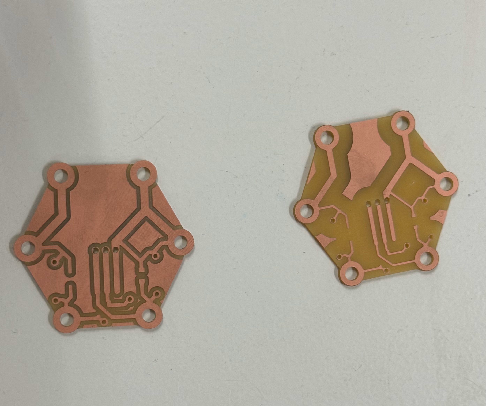
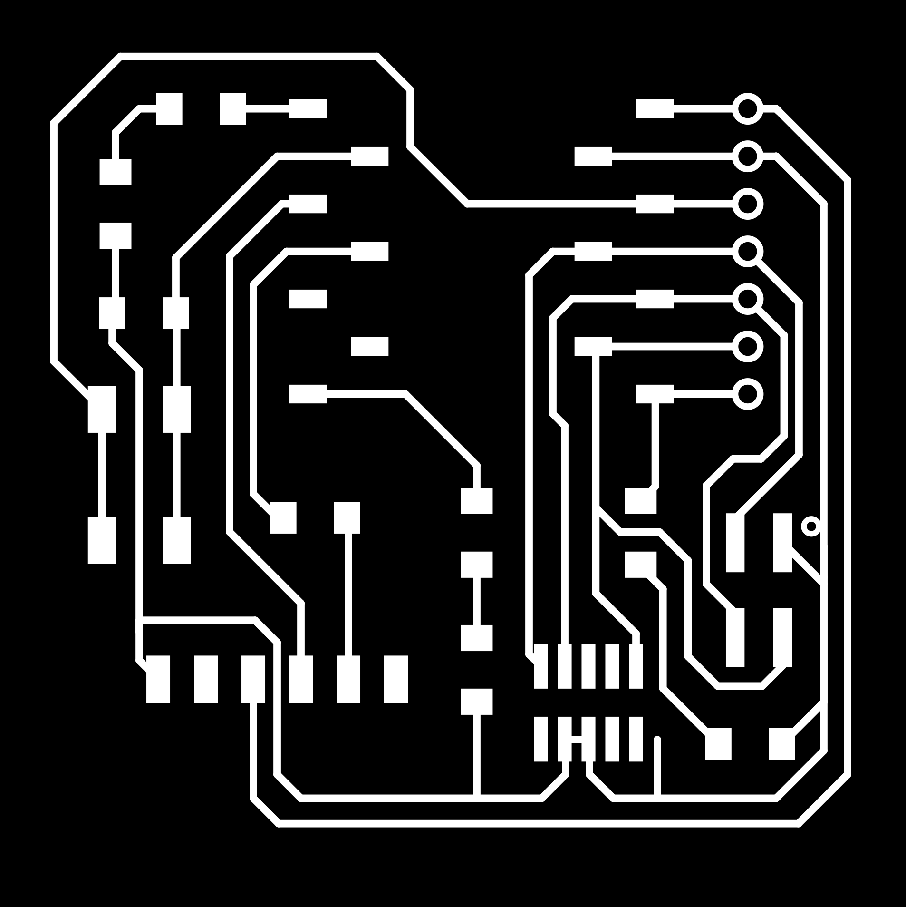
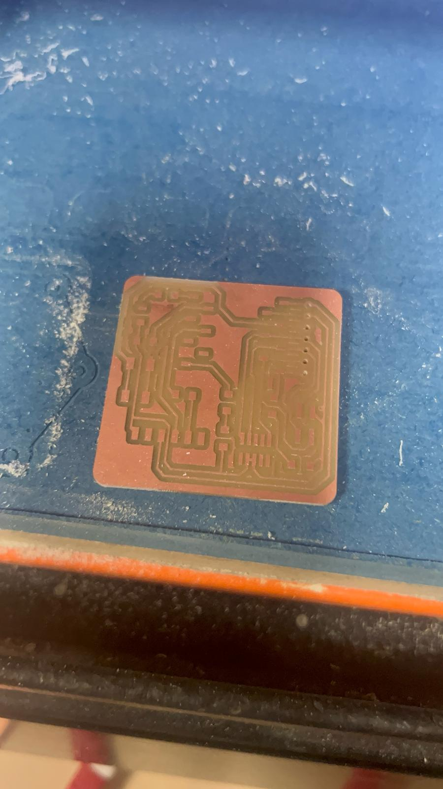

---
hide:
    - toc
---

!!! info "Electronics Design"
    ==FACULTY==: Daniel Mateos San Martin
    
    ==CALENDAR==: 26/02/2025 - 27/02/2025

    ==TRACK==: Fab Academy

!!! quote

    # 🚼Electronics Production taught me how to turn copper into code—and how to gracefully step back when solder smoke meets baby bump.🤰
    
!!! abstract "Notes"
    [Class notes link Click~](https://fablabbcn-projects.gitlab.io/learning/educational-docs/fabacademy/classes/08-ElectronicsProduction/)👈

!!! example "Reflection"
    In this class, we were introduced to the basics of electronics production by fabricating a pre-designed PCB board that supports the ESP32 microcontroller (Tau 4020 model). The process revolved around using digital fabrication tools—particularly CNC milling—to bring a circuit board from screen to physical form. It was a great opportunity to better understand how electronics go from design files to functional objects.🤩

    {: style="height:400px;width:480px"}
    {: style="height:400px;width:480px"}

    We started by preparing the files using ModsProject.org, which allowed us to convert the instructor’s layout into formats readable by the SRM-20 milling machine. Although we didn’t have to design the board ourselves, walking through the process of defining cut depths, setting the origin, and exporting traces and outlines helped me grasp how important precision is when preparing files for fabrication.

    {: style="height:400px;width:280px"}
    {: style="height:400px;width:280px"}
    {: style="height:400px;width:280px"}

    The CNC milling part was particularly satisfying😏. Watching the machine carve out clean paths on the copper plate was mesmerizing and gave me a new appreciation for the role of machines in electronics prototyping. It also gave me confidence to handle more digital fabrication tasks in the future, especially with electronics-related projects.

    Due to my pregnancy🤰😶‍🌫️👶, I wasn’t able to participate in the soldering phase this time, since the fumes can be harmful. However, I do have previous soldering experience from MDEF 1 last year, where I worked on several projects involving soldering small components onto custom boards. I remember how delicate and time-consuming it can be, and while I missed that part of the hands-on work this time, I still followed along and observed my classmates' process, which helped refresh my memory.

    {: style="height:400px;width:580px"}

    Overall, this class helped me connect the dots between digital tools and hardware prototyping. Even though I had to sit out one phase for health reasons, I still felt actively engaged and walked away with a much clearer understanding of how PCBs are milled, structured, and tested. I'm looking forward to applying this knowledge to future interactive or electronics-based projects, hopefully with boards I design myself.💗