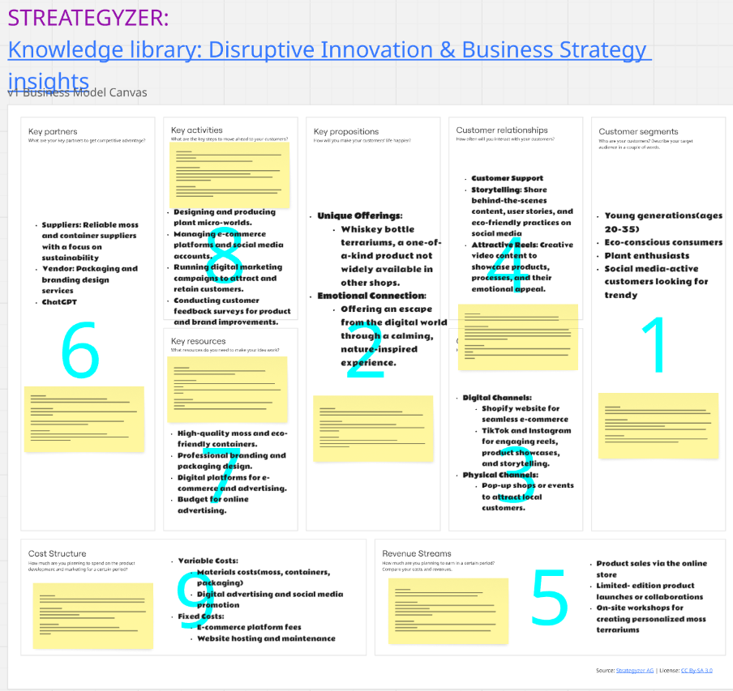
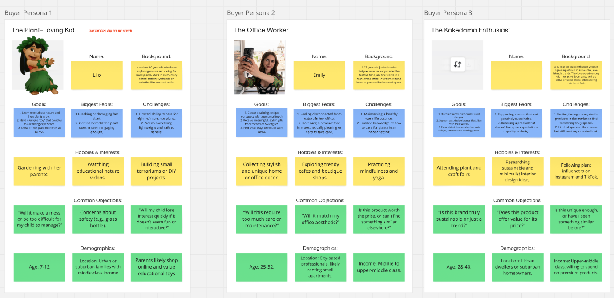
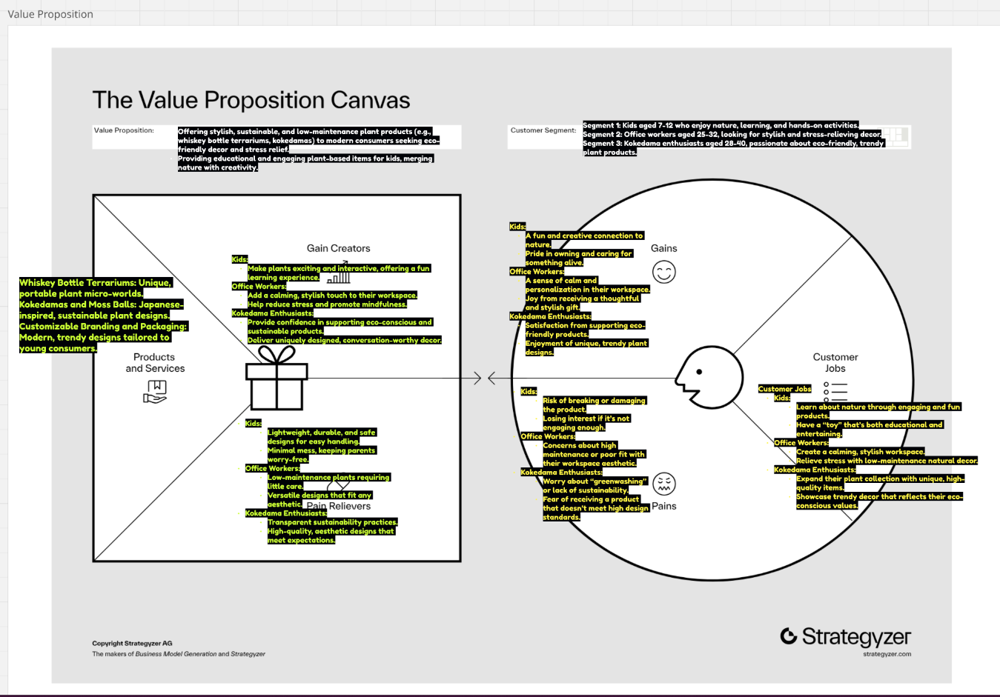
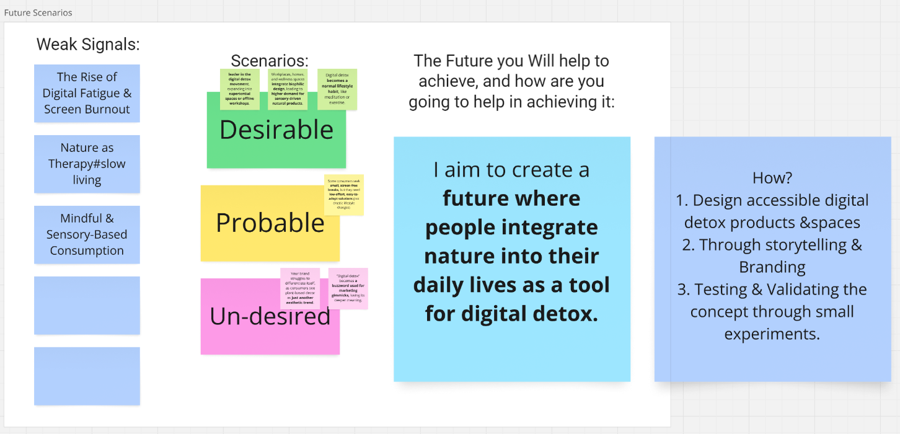
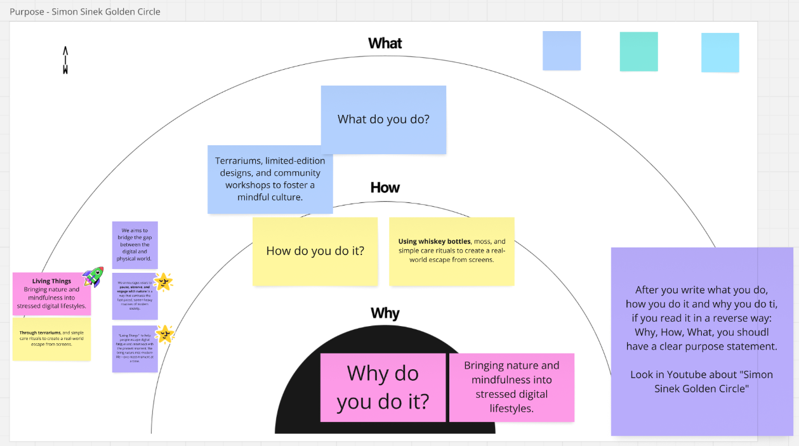

---
hide:
    - toc
---

!!! info "Mentorship"
    ==FACULTY==: Pablo Zuloaga
    
    ==CALENDAR==: 20/01/2025, 31/01/2025, 20/02/2025, 26/03/2025

    ==Focus==:Business structure, strategy, and future development for my thesis project

    ==Format==: 10 private sessions, 30 minutes each

!!! quote

    # Coming
    
    
!!! abstract "Notes"
    !!!notes "Session 1"
        ## Introduction & Business Model Canvas

        In our first meeting, I introduced Pablo to my thesis project—Living Things, a plant-based brand focusing on digital detox and emotional well-being.
        
        He assigned me to complete a Business Model Canvas in order to better understand my project's key components, such as value propositions, customer segments, channels, and revenue streams.

                
    !!!notes "Session 2"
        ## Future Scenarios & Golden Circle

        Pablo introduced me to the concept of future scenario planning to help forecast potential directions for the business.
        
        We discussed emerging trends like:

        Digital Fatigue

        Mindful & Sensory-Based Consumption

        He also guided me through Simon Sinek’s Golden Circle (Why / How / What) to sharpen my brand purpose and message.

        I began defining my “weak signals”—early indicators of change—to help shape realistic yet visionary scenarios for the future.

        

        

        
        

        !!!notes "Session 2 Feedback"
            ## 1. Business Model Canvas

            ### 1.1 Positive Observations

            Clearer Partnerships & Focus: 
            
            Reliable moss/container suppliers, packaging/branding vendors, and the inclusion of sustainability factors help solidify your eco-friendly positioning.

            Essential Activities: 
            
            Designing terrariums, managing e-commerce, digital marketing, and obtaining customer feedback are well-defined actions that match a direct-to-consumer plant business.
            Value Proposition: Emphasizing “escape from the digital world” and the unique whiskey bottle terrariums adds distinction to your offerings.

            Channels & Customer Relationships: 

            Social media (Instagram, TikTok) for storytelling and pop-up events for in-person engagement are aligned with a visually appealing, lifestyle-oriented product.

            Cost & Revenue Streams: 
            
            Dividing costs into variable (materials, social media promotion) and fixed (platform/hosting) expenses is realistic. Revenue from online sales, limited-edition launches, and workshops shows diversified potential.

            ### 1.2 Areas for Improvement

            Deepen the Digital Detox Element: 

            Strengthen the connection between your social media presence and your mission to reduce digital overload—possibly via mindful content or offline-focused events.

            Prioritize Segments: 
            
            Currently, you list young adults (20–35), eco-conscious consumers, plant enthusiasts, and social media-savvy shoppers. Narrowing down or testing which group resonates most can avoid a diluted brand message.

            Highlight Storytelling & Upcycling: 
            
            The whiskey bottle design is a powerful sustainability narrative. Make sure this story is woven into every aspect, from marketing to workshops.

            ### 1.3 Guiding Questions

            Which partners are indispensable for your operations and brand story, and how might you form partnerships that reinforce your “nature-inspired escape”?

            How can you balance social media marketing with the idea of “digital detox,” ensuring your online presence encourages mindful usage?

            Among your listed segments, who will be your ideal early adopters—most willing to pay for a nature-inspired, premium product?

            
            ## 2. Buyer Personas

            Your three existing Buyer Personas (Kids, Office Workers, Kokedama Enthusiasts) show diverse motivations and needs. However, with the updated Business Model Canvas, it looks like you are focusing on:
            Young generations (20–35)
            Eco-conscious consumers
            Plant enthusiasts
            Social media-active shoppers seeking trendy products

            ### 2.1 Positive Observations

            Realistic Fears & Goals: 
            
            You mention concerns such as maintenance, style, pricing, and authenticity.

        
            Lifestyle Clarity: 
            
            Office workers want stress relief at a desk, plant enthusiasts crave unique and sustainable designs, and younger consumers often look for eye-catching “Instagrammable” items.

            ### 2.2 Areas for Improvement

            Too Many Segments? Serving all these groups equally might dilute your messaging. Consider who is most aligned with your “digital escape” proposition.

            Add Real-World Constraints: Include potential objections like budget, lack of time for plant care, or preference for local/DIY solutions.

            Strengthen Digital Detox Link: If “escape from digital overload” is central, each persona’s daily routine should reflect how they are actively trying—or failing—to disconnect from screens.

            ### 2.3 Guiding Questions

            - Which persona is your most natural early adopter or brand champion, and why (office workers, eco-friendly enthusiasts, or social media trendsetters)?

            - What hidden barriers or deeper frustrations could these personas have (e.g., price sensitivity, skepticism about brand claims)?

            - How can you weave “mindful disconnection” into each persona’s lifestyle to reinforce the value of your terrariums?

            ## 3. Value Proposition Canvas

            ### 3.1 Positive Observations

            Clear Gains & Pain Relievers: 
            
            You address stress relief, low-maintenance plant care, and an eco-friendly design—key attractions for modern consumers.

            Visual/Emotional Appeal:

            Emphasizing unique, conversation-worthy décor, plus the whiskey bottle upcycling concept, sets you apart.

            ### 3.2 Areas for Improvement

            Combining Multiple Segments: 
            
            With different needs (young social media users vs. seasoned plant enthusiasts), a single Value Proposition Canvas can become generic. Consider creating separate canvases for each major segment or focusing on the primary audience.

            Strengthen the “Escape from Digital” Benefit: 
            
            Position your terrarium not just as décor, but as a micro-ritual of mindfulness, offering a genuine digital break.

            Deepen Sustainability Claims: 
            
            Illustrate the authenticity of your eco-friendly practices (local materials, transparent sourcing, responsible disposal or recycling).

            ### 3.3 Guiding Questions

            - What truly differentiates your product from other plant décor items? How does it deliver a meaningful digital detox experience?

            - How might you enhance your sustainability narrative—e.g., where do the whiskey bottles come from, how do you manage packaging waste, etc.?

            - Would a dedicated Value Proposition Canvas per segment yield more specific insight into Gains, Pains, and Jobs?

            ## 4. Recommended Next Steps

            Below is a roadmap that integrates design futures thinking with practical business validation:

            ### 4.1 Explore “Weak Signals” and Future Scenarios

            Identify Emerging Signals: 
            
            Research or articulate at least 3–5 cultural or market shifts relevant to your brand (e.g., increasing digital fatigue, urban interest in biofilia, the rise of upcycling).

            Draft Possible Futures: 
            
            Develop short scenarios (optimistic, pessimistic, likely) illustrating how your terrariums could become even more valuable as technology continues to permeate daily life.

            Key Question: 
            
            “Which future behavior changes do you want to spark, and how does your product catalyze them?”

            ### 4.2 Refine the Project Purpose (Golden Circle)

            WHY / HOW / WHAT:
            
            WHY: Clarify your mission—bringing nature and mindfulness into stressed digital lifestyles.

            HOW: Use whiskey bottles, eco-friendly materials, and small “caring rituals” to create a tangible sense of escape.

            WHAT: Terrariums, limited-edition items, workshops.

            Broader Mission: Communicate how your business fosters a new culture of mindful disconnection and environmental awareness.

            Key Question: 
            
            “If terrariums are just a vehicle, what long-term impact or transformation do you aspire to create?”

            ### 4.3 Validate Core Hypotheses

            Formulate Hypotheses: Examples include
            “Office workers are willing to invest in a premium terrarium for daily stress relief.”

            “Eco-conscious millennials prefer upcycled products over generic store-bought plants, if the price is right.”

            Design Rapid Experiments:

            - Conduct quick interviews with target customers.
            - Create a simple landing page or social post to gauge interest.
            - Offer a small pilot workshop or pop-up event to see who attends and why.
        

            Key Question: 
            
            “What minimal experiments can confirm or challenge your assumptions in the shortest time possible?”

            ## 5. Conclusion

            Your project has strong potential to move beyond being just a “trendy plant shop.” By highlighting digital detox, mindful living, and sustainability, you can carve out a unique space that resonates with real cultural shifts. Strengthening your narrative, narrowing your target where necessary, and validating your core assumptions early will help shape a truly future-oriented brand.

    !!!notes "Session 3"
        ## Scenario Building, Weak Signals & Workshop Planning

        This session went deeper into design futures thinking:

        I created three future scenarios, grounded in weak signals (e.g., rise of digital fatigue, biophilia, and the popularity of upcycled products).

        We discussed how these could be written as micro-stories:

        “By 2050, [this] is happening… therefore, my brand does [this].”

        We also discussed planning my kokedama workshop as a prototype for validation. Topics included:

        Duration, materials, communication strategy

        How to collaborate with a flower shop (potential event in Barcelona in March)

        Benefits for both my brand and the hosting space

        Key insight: I should define what I want to validate (e.g., price point, ritual value, brand story) and how to test that through real-world feedback.

        

        

    !!!notes "Session 4"
        ##  Business Plan Development

        We began shaping a full business plan that includes:

        - My mission and brand purpose

        - Product lines and customer journeys

        - Marketing strategy (especially how to align mindful messaging with social media use)

        - Validation and experimentation methods

        - Collaborations and possible funding or resource partnerships

        Pablo emphasized that the business plan is not just for presentation—it’s a tool to align my actions with my values and prepare for real-world development post-thesis.