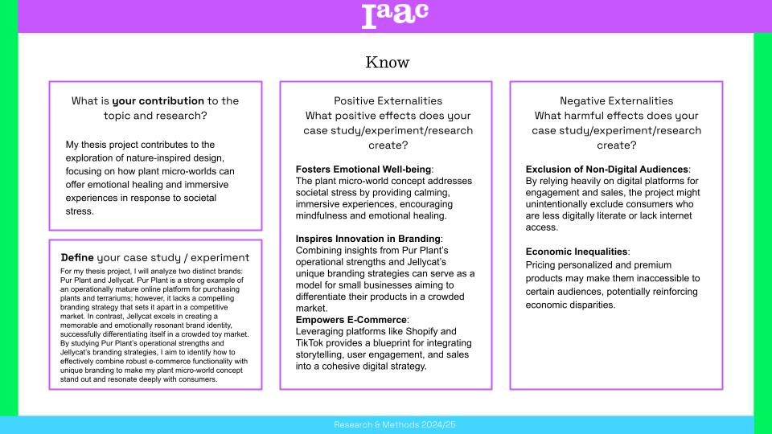
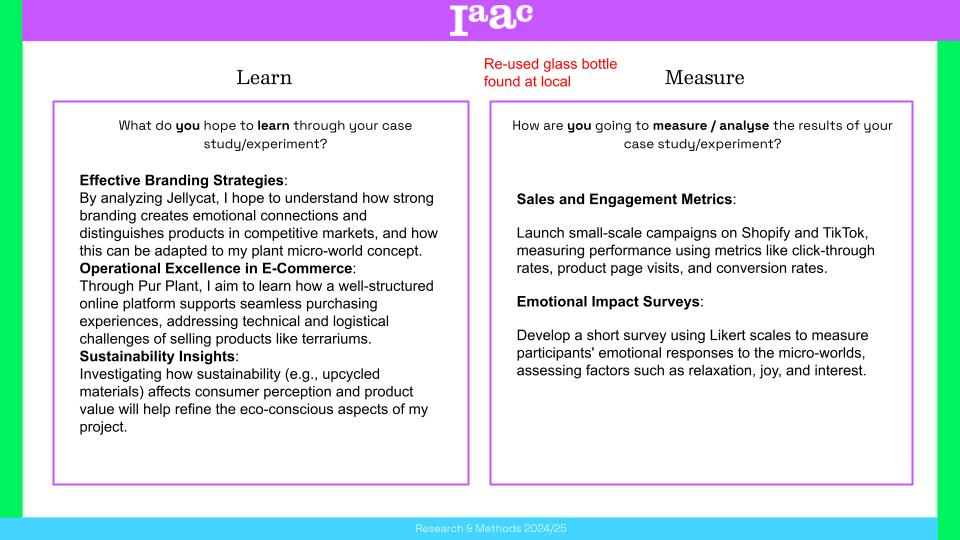
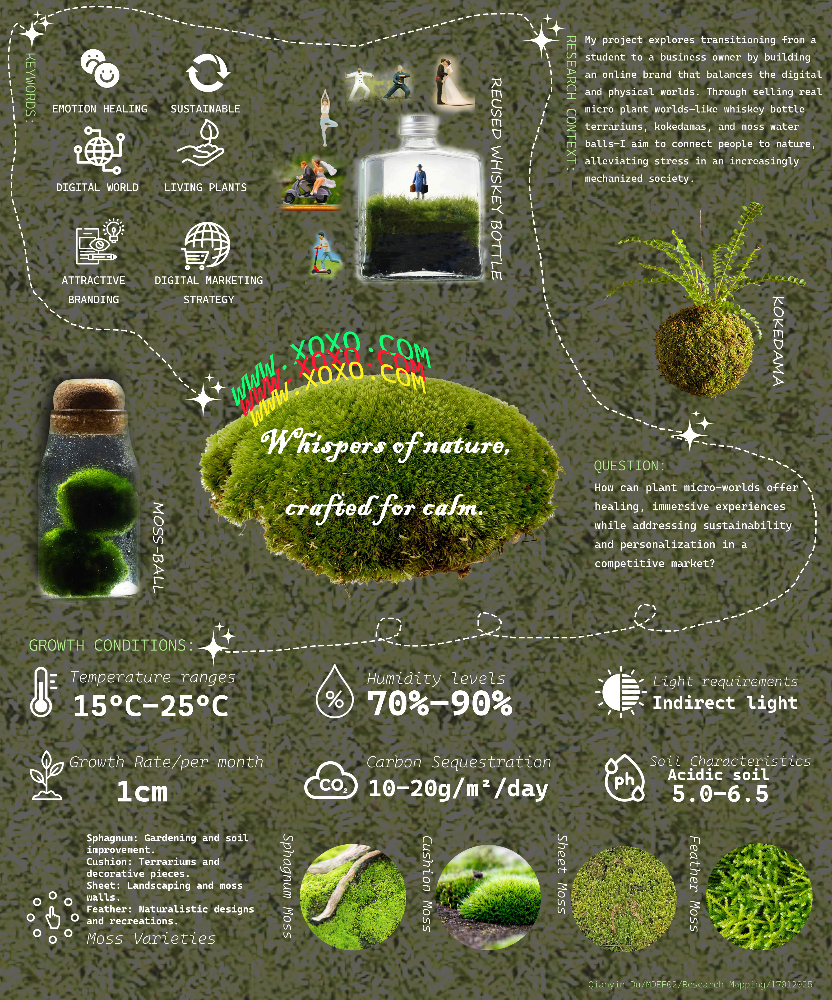
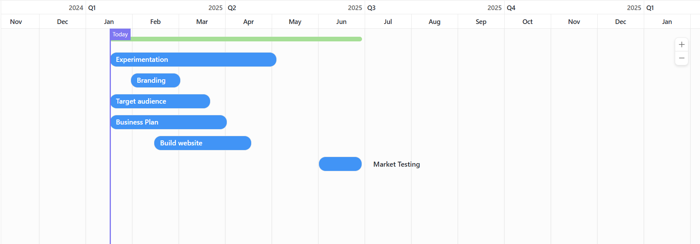

---
hide:
    - toc
---

!!! info "Research & Methods Workshop"
    ==FACULTY==: Mathide M./ Fiona D./ Nikol K.
    
    ==CALENDAR==: 14/01/2025 - 17/01/2025

    ==TRACK==: Reflection

!!! quote

    # When the thesis felt like a storm of scattered thoughts, Research and Methods handed me a map—and suddenly, the chaos started to make sense.
    
    
!!! abstract "Notes"
    Design Problems = Wicked Problems

    We need to ==ARUGUMENT== our position.

!!! example "Reflection"
    This course has been essential in helping me give structure and clarity to my thesis journey. Unlike hands-on or production-based classes, Research and Methods offered a space to step back, think critically, and make sense of the bigger picture. Through lectures and guided exercises, I began shaping the foundation of my thesis project—not just the "what," but the "why," "how," and "when."

    {: style="height:400px;width:650px"}

    {: style="height:400px;width:650px"}

    One of the most valuable tools introduced was the Research Map. Our professor described it as a way to untangle the complex system of objectives, methods, experiments, and findings that form a thesis. At first, it felt overwhelming trying to visualize everything at once, but mapping things out allowed me to see connections I hadn’t considered before. It helped me organize scattered ideas, identify gaps, and create a roadmap I could actually follow.

    {: style="height:600px;width:480px"}

    We also created a time plan table to manage our progress from January to June. This exercise forced me to think realistically about my goals, breaking down the massive “thesis” into actionable monthly steps. It gave me both direction and peace of mind—like giving future-me a guide to not completely panic.

    {: style="height:400px;width:300px"}
    {: style="height:400px;width:600px"}

    Beyond just planning, the course helped me shift my mindset. I realized research isn’t just about collecting data or reading articles—it’s about asking the right questions, framing an argument, and building evidence with intention. It encouraged me to think about why my project matters, not just what it looks like.

    Overall, Research and Methods has been like a compass during the foggy beginnings of thesis development. It reminded me that even if things feel chaotic, there’s always a way to untangle the web—one map, one objective, and one step at a time.

    
