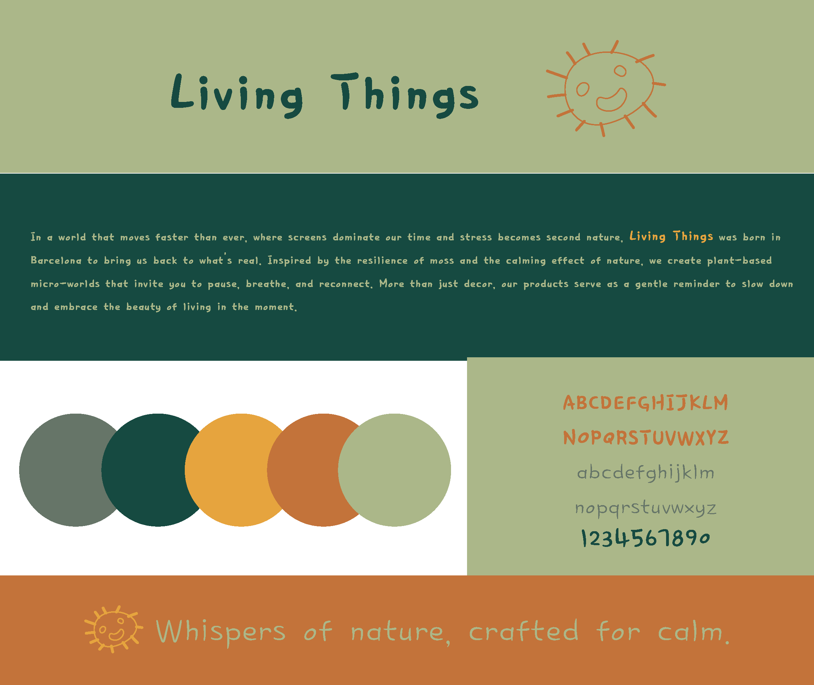
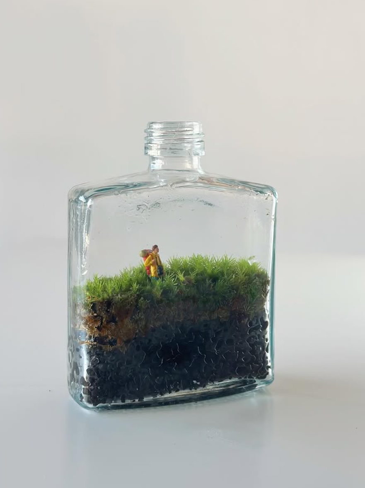
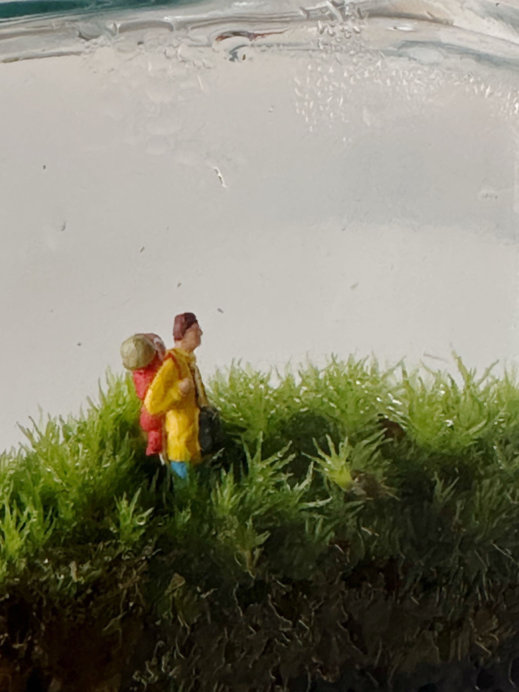
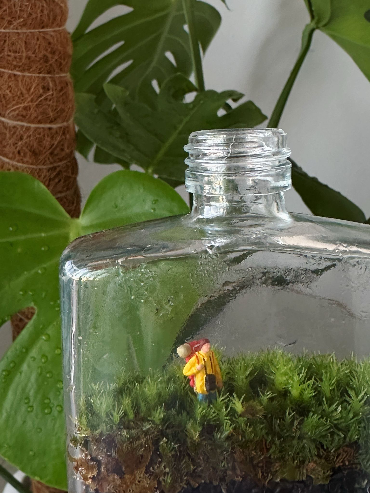
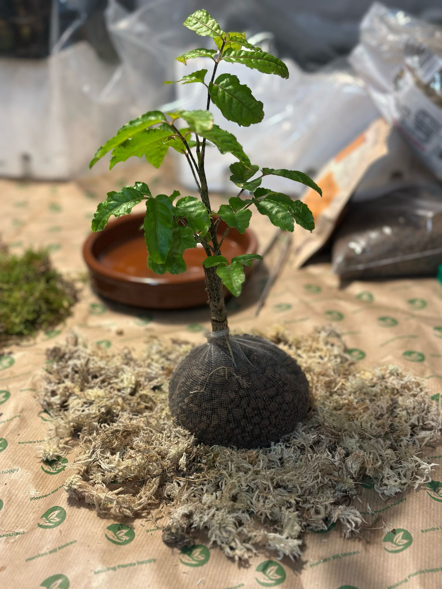
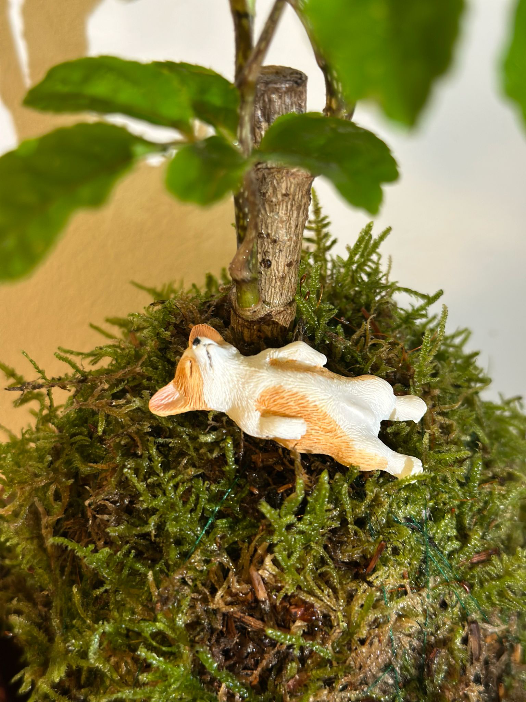
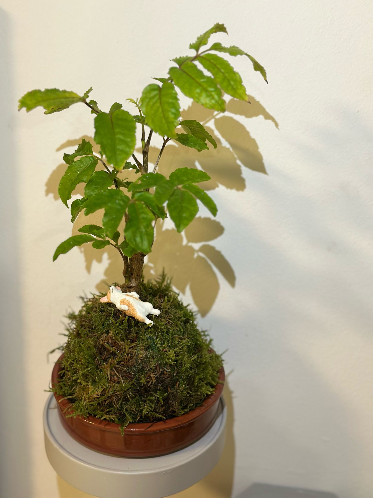
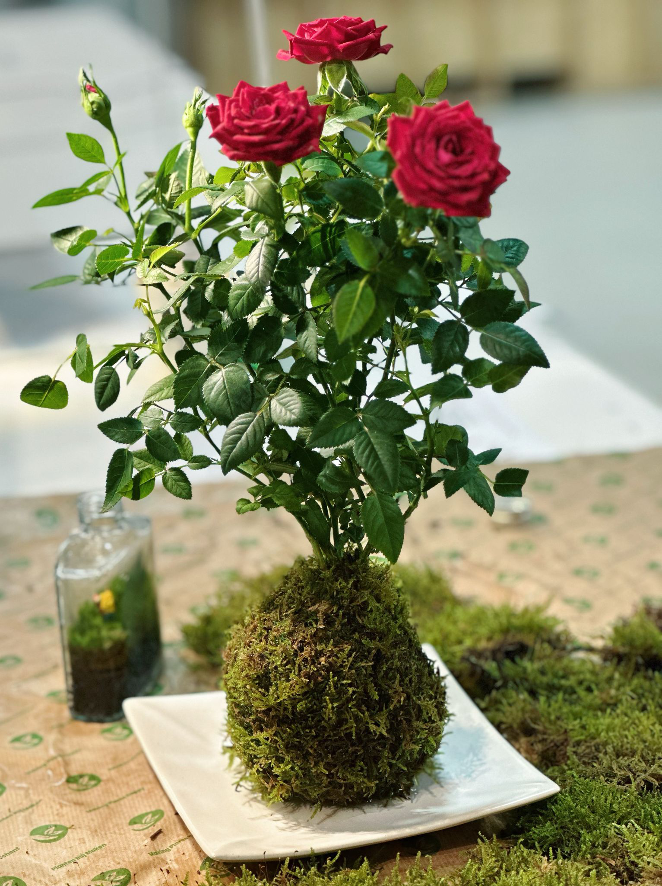
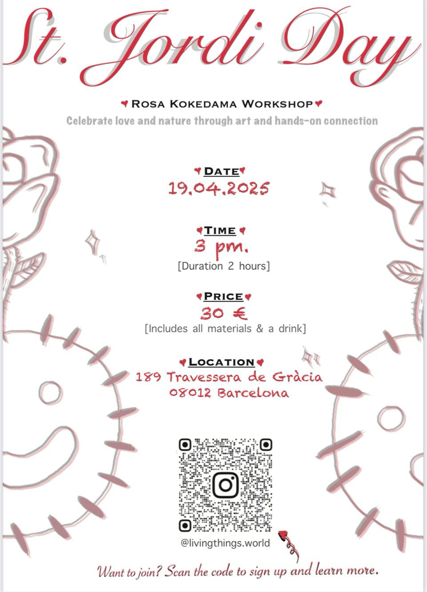
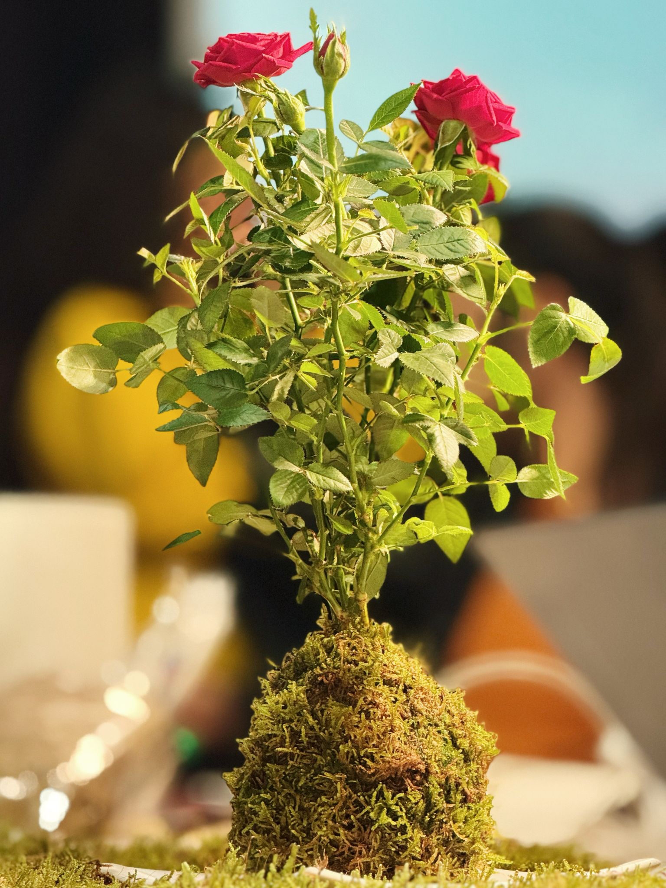

---
hide:
    - toc
---

!!! info "Thesis Project"
    ==FACULTY==: Jana Tothill Calvo/ Roger Guilemany/
    
    ==CALENDAR==: 09/01/2025 - 28/03/2025

    ==TRACK==: Reflection

!!! quote

    # (๑•́ ₃ •̀๑) whispers of nature, crafted for calm [@livingthings_world](https://www.instagram.com/livingthings.world/)👈🤩
    
!!! abstract "Notes"
    ## New thesis question:

    How can spatial and product design facilitate digital detox through nature-based interactions, helping individuals escape digital fatigue and reconnect with real-world experiences?

    ## Branding story:

    In a world that moves faster than ever, where screens dominate our time and stress becomes second nature, Living Things was born in Barcelona to bring us back to what’s real. Inspired by the resilience of moss and the calming effect of nature, we create plant-based micro-worlds that invite you to pause, breathe, and reconnect. More than just decor, our products serve as a gentle reminder to slow down and embrace the beauty of living in the moment.

    !!!example "1.0 version Logo for "Living things""

        

    !!!example "Whisky micro-world"
        {: style="height:400px;width:300px"}
        {: style="height:400px;width:300px"}
        {: style="height:400px;width:300px"}

    !!!example "Kokedamas"
        {: style="height:400px;width:300px"}
        {: style="height:400px;width:300px"}
        {: style="height:400px;width:300px"}

    !!!example "Rosa Kokedamas"
        {: style="height:400px;width:300px"}
        {: style="height:400px;width:300px"}
        {: style="height:400px;width:300px"}

!!! example "Reflection"
    !!!abstract "Term II Conclusion"
        ## Living Things: Reconnecting with Nature through Digital Detox Design

        ### 1. My Community of Practice: Motivation, Commitment, and Context

        ##Motivation:

        The initial spark for my thesis project, Living Things, came from a deeply personal need: the desire to disconnect from digital overload and reconnect with something tangible, alive, and calming. Living in Barcelona and observing the fast-paced, screen-driven lifestyle of both myself and those around me, I began to explore how nature—especially moss and micro plant environments—can serve as a form of digital detox. The project is grounded in my belief that modern society is in urgent need of slow, sensory-based experiences that bring mindfulness into our daily lives.

        ##Commitment:

        This commitment became clearer after months of research and iterative work within my immediate environment. The project began with my fascination with kokedamas and evolved into crafting moss-based micro worlds inside recycled whiskey bottles. While my initial direction leaned toward sustainability and upcycling, I gradually realized that what truly resonated with people was the emotional and sensory relief these products provided—prompting a shift toward digital detox as the project's core narrative.

        ##Context:

        The community of practice I engage with includes young creatives, digital workers, urban dwellers, and plant lovers who seek calm, connection, and meaning through nature. They are people who are often exposed to high levels of digital stress and are interested in wellness, mindfulness, and aesthetic living. My community exists both physically—in local markets, workshops, and studios—and digitally, via platforms like Instagram and TikTok. My participation in pop-up events and Sant Jordi workshops has helped me localize and territorialize the brand within Barcelona while also growing a presence in a broader online ecosystem.

        ##What is shared:

        - A desire for calm and meaningful living
        - Curiosity around plant care and sensory rituals
        - A rejection of fast, over-automated experiences

        ##What is not shared:

        - Not all in the community are familiar with the concept of digital detox
        - Some prefer purely aesthetic plants rather than emotional or mindful experiences
        - Others are skeptical of emotional design or "green therapy"
        
        ##Contributions: 
        
        My project contributes by offering a new kind of product that functions both as a design object and a ritual artifact. It encourages a shift in perspective—from passive digital consumption to mindful, nature-based interaction. I also aim to provide a safe and inspiring platform for conversation around balance, slow living, and the emotional power of nature.

        ###2. Field Research Report

        ##Methods of Engagement:

        - Hosting workshops (e.g., kokedama-making on Sant Jordi)
        - Participating in local pop-up markets
        - Creating interactive Instagram content (reels, polls, behind-the-scenes)
        - Conducting interviews and informal chats with customers and participants

        ##Interventions:

        - A soft launch of products via Instagram (@livingthings.world)
        - In-person workshop events with storytelling and hands-on crafting
        - Testing the emotional response of users interacting with moss micro worlds

        ##Insights Gained:

        - High Emotional Engagement: Participants consistently mentioned how "calm" or "soothing" it felt to touch moss or watch it be arranged.
        - Curiosity-Driven Interaction: People loved the figurines in the micro-worlds—especially the travelers, dogs, and cozy home scenes.
        - Digital Fatigue is Real: Many attendees said they were actively trying to reduce screen time and loved the idea of "touching nature" as a break.
        - Visual Storytelling Matters: Posts that featured soft colors, tiny figures, and moss textures performed significantly better than traditional product photos.
        - Bilingual Content Works: Incorporating both English and Spanish/Catalan made the project feel local and international simultaneously.

        ##Challenges:

        - Not everyone immediately understood the link between moss and digital detox.
        - Some participants expected plants to be low-cost or "just decor," requiring educational framing.

        ###3. Prototype Testing and Feedback Analysis

        ##Prototypes Tested:

        - Moss micro worlds in whiskey bottles (sealed and open-top)
        - Small kokedamas with themed additions (e.g., mini rose for Sant Jordi)
        - Portable moss holders with LED fairy lights

        ##Feedback Mechanisms:

        - Live feedback at pop-up events
        - Instagram poll responses
        - Direct messages and story replies
        - Follow-up conversations with workshop attendees

        ##Key Feedback Themes:

        - People love narrative: When moss is paired with a theme (e.g., "the traveler" or "the quiet dog"), it creates emotional resonance.
        - Small scale is appealing: Portable designs were favored because they fit into offices, desks, or bedside tables.
        - Gifting potential: Many buyers saw these as perfect gifts—"better than flowers," as one said.
        - Desire for personalization: Several people asked if they could choose the figures or themes in the moss worlds.

        ##Iterations Made:

        - Introduced narrative themes in product lines (e.g., "micro love world," "nature escape")
        - Added customization options
        - Began planning a digital ritual guide (how to use your moss moment for mindfulness)
        - Adjusted price points and packaging based on audience expectations
        
        ##Conclusion:

        The Living Things project is more than a product line; it's a response to a collective need for calm in a hyperconnected age. By working within and alongside my community of practice—both physically and digitally—I’ve developed a space where storytelling, nature, and emotional design intersect. Moss is no longer just a plant; it’s a tool for reconnection.
