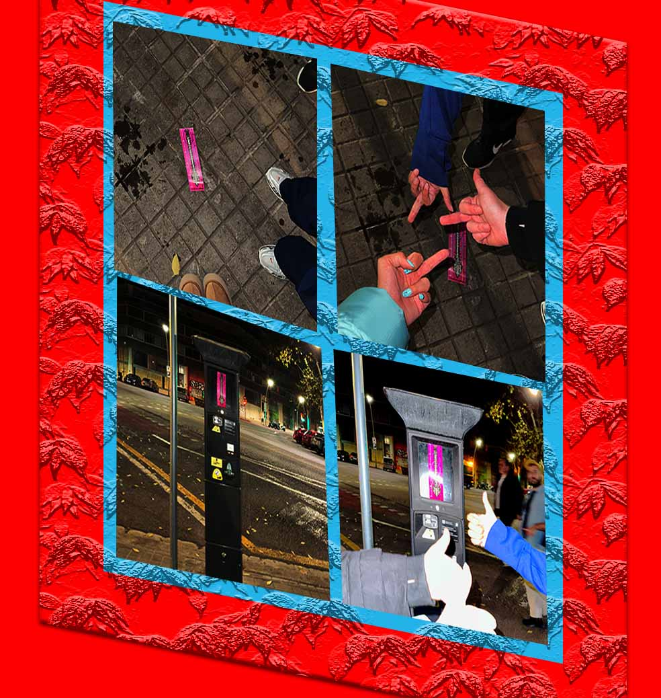

---
hide:
    - toc
---   
!!! info "Documenting Design"
    ==FACULTY==: Pablo Zuloaga Betancourt
    
    ==CALENDAR==: 4 sessions

    ==TRACK==: Reflection

!!! quote
    <center>
    {: style="height:300px;width:230px"}

    ## **:sparkling_heart:"Documentation is a love letter that you write to your future self. (Damian Conway)" By Pablo:sparkling_heart:**


    </center>


!!! bug "Videos"
    # **Tiktok Time :) Check out MDEF2023 Tiktok dance**
    I'm sorry to hear that some of our soldiers do not like TikTok. However, the truth is that TikTok is a huge community and a modern way to "show off." So if you're in this master's program, try not to express dislike for any programs. Because this will mean you are not ready for the future.

    For me, the future equals absorbing like a sponge. Enjoy absorbing until, someday, the answers to the future will come to you.

    In China, TikTok used to have an incredible impact on value districts (who does not love money?). To change the future, one thing we cannot reject, even though we all know this item belongs to Babylon, ==**money and properties**==
    
    <iframe width="560" height="315" src="https://www.youtube.com/embed/XF9_PYRdIx4?si=NZSWyO7i4Avk6vys" title="YouTube video player" frameborder="0" allow="accelerometer; autoplay; clipboard-write; encrypted-media; gyroscope; picture-in-picture; web-share" allowfullscreen></iframe>


!!! failure "angry moment"
    <center>
    {: style="height:400px;width:350px"}
    </center>

    Link to The Machine Paradox Intervention: https://33dudu.github.io/magicreator/term1/05-%20The%20Machine%20Paradox/
    
    **During the Open House Night on 11/24/2023, we exhibited our Machine Paradox intervention machine in the main hall. Many people came and explored. I only had 15 bookmarks left. At the same time, I was in the bio lab playing with some new materials.

    - Story 1:
        But somehow, I saw people take my bookmarks. So, I went to talk to them and said: if you have the bookmark, you should play our ==LifeX game==; otherwise, it doesn't make sense to have the bookmark. BUT the person ==rejected== me.

    - Story 2:
        On the way back home, /me, Minnie, and Annna/ saw this abandoned baby on the floor, and below are our reactions to that, ==ENJOY==."

        Link to The Machine Paradox Intervention: https://33dudu.github.io/magicreator/term1/05-%20The%20Machine%20Paradox/
        

!!! failure "FEELING STUPID moment"


!!! abstract "futurewebsite prototype"
    example for diagrams
    ``` mermaid
    graph LR
    A[Start] --> B{Error?};
    B -->|Yes| C[Hmm...];
    C --> D[Debug];
    D --> B;
    B ---->|No| E[Yay!];
    ```

    <iframe style="border: 1px solid rgba(0, 0, 0, 0.1);" width="800" height="450" src="https://www.figma.com/embed?embed_host=share&url=https%3A%2F%2Fwww.figma.com%2Fproto%2FcC0xoh7U7sqyXNxWp6oX6E%2FMAGICREATOR%3Fpage-id%3D0%253A1%26type%3Ddesign%26node-id%3D8-113%26viewport%3D261%252C7%252C0.24%26t%3D4Ekya8Njaj2gLmLx-1%26scaling%3Dcontain%26mode%3Ddesign" allowfullscreen></iframe>