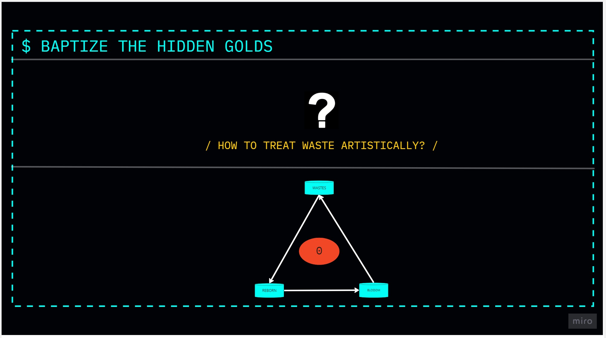
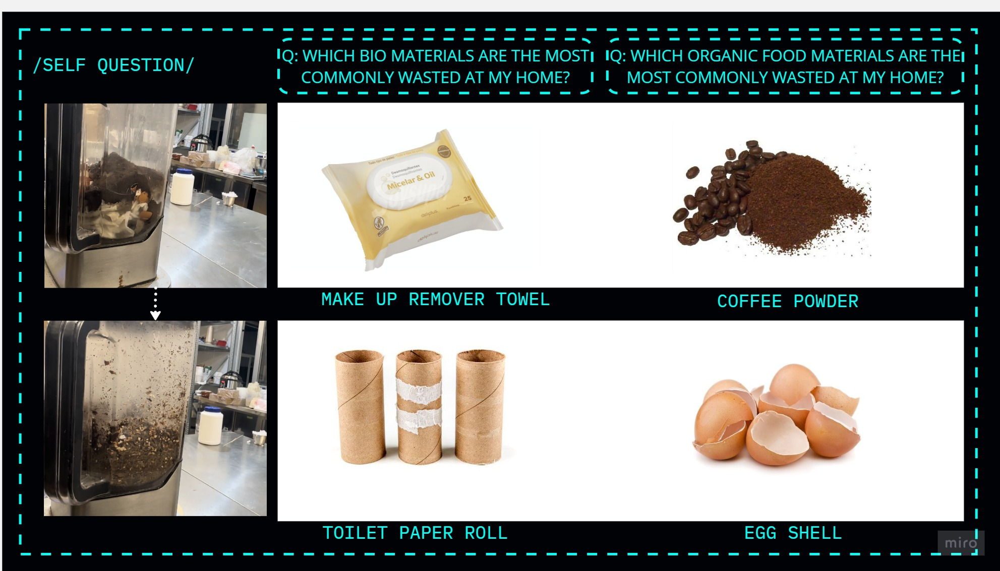

---
hide:
    - toc
---


!!! info "Living With Your Own Ideas"
    ==FACULTY==: Osacar Tomico / Kristina Andersen
    
    ==CALENDAR==: 31/10/2023 - 03/11/2023

    ==TRACK==: Reflection

!!! quote
    <center>
    # **:hole: Past/Present/Future :hole:**

    {: style="height:350px;width:600px"}

    > Blurring the boundaries

    > Brain is a terrible place to storage ideas

    > By Whom? For Whom? Against Whom?

    > We are living in catastrophicaly(tragic)

    </center>


   
!!! note "Reflection"
    <center>

    {: style="height:350px;width:600px"}
    {: style="height:350px;width:600px"}

    !!! tip "<font color="white">Process"
        <font color="deeppink">
        ## Ep #1        
        

        <iframe width="560" height="315" src="https://www.youtube.com/embed/c9WD2AHcpDQ?si=8UcoEcxowE_CTzaz" title="YouTube video player" frameborder="0" allow="accelerometer; autoplay; clipboard-write; encrypted-media; gyroscope; picture-in-picture; web-share" allowfullscreen></iframe>

        <font color="deeppink">
        ## Ep #2</font>

        
        <iframe width="560" height="315" src="https://www.youtube.com/embed/tnm34RBTk4A?si=QWjLr4JjUISixhip" title="YouTube video player" frameborder="0" allow="accelerometer; autoplay; clipboard-write; encrypted-media; gyroscope; picture-in-picture; web-share" allowfullscreen></iframe>    
        
    {: style="height:350px;width:600px"}
    {: style="height:350px;width:600px"}
    {: style="height:350px;width:600px"}
    {: style="height:350px;width:600px"}
    {: style="height:350px;width:600px"}
    {: style="height:350px;width:600px"}

    </center>

    !!!abstract "**Repurposing wates:**" 
        > ##Not only innovative but also environmentally conscious.


        _10/28/2023_

        I unveiled my latest art sculpture, a masterpiece I affectionately named ==HARIBO DE HARWEEN==. This unique creation is a testament to my exploration of artistic possibilities within the realm of discarded materials.

        The genesis of this project led me to ponder a profound question: =="How can wastes be treated artistically?"== Armed with curiosity and a commitment to sustainability, I delved into my household's most commonly ==wasted bio materials==. The resounding answers ==emerged—makeup remover towels paired with toilet paper rolls, and coffee powder intertwined with eggshells==.

        Weekend experimentation ensued to test the viability of these materials for sculptural purposes. 
        
        I employed two distinct drying methods—firstly,
        > 1. utilizing the weight of heavy objects and an indoor environment, 

        > 2. basking in the warmth of the Mediterranean sun and the caress of the wind in an outdoor setting.

        _10/30/2023_

        As October waned into the 31st, the results were promising, leaving me with a modest bag of leftovers. During a serendipitous moment in class, I stumbled upon a discarded hard disk drive in IAAC room 301. It became the unexpected mold for my artistic endeavor. Into its metallic embrace, I carefully placed the remnants, opting for the ==outdoor drying method== once again.

        Myself, serving as both creator and instrument, infused a distinctive perspective and vision into the sculpture. It highlighted the symbiotic relationship between the artist and the material, transcending the mere act of creation.

        Looking ahead, a second iteration of the waste materials beckons. This time, a new step emerges—using ==mortar to delicately smash the eggshells==. The palette expands, introducing two colors: 1. with the richness of coffee powder. 2. in its pure, unadorned form.

        As the project unfolds, it becomes more than just a sculpture; it transforms into a narrative of renewal, where discarded materials find beauty, purpose, and a second chance. May this artistic journey continue to captivate and inspire, a celebration of sustainability and creativity intertwined.

        Readings:
        A guide to successful autoethnography


!!!info "References"
    example for diagrams
    ``` mermaid
    graph LR
    A[Start] --> B{Error?};
    B -->|Yes| C[Hmm...];
    C --> D[Debug];
    D --> B;
    B ---->|No| E[Yay!];
    ```