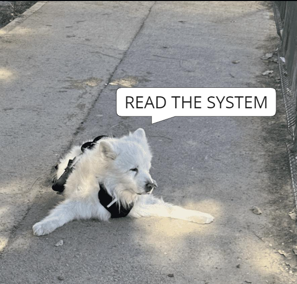
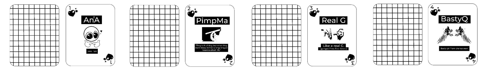
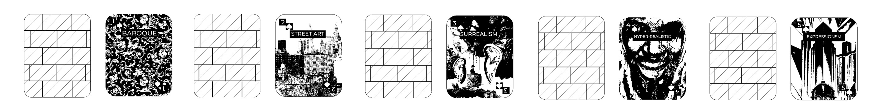

---
hide:
    - toc
---

!!! info "Design With Others"
    ==FACULTY==: Holon/ Adrià Garcia i Mateu/ Markel Cormenzana/ Milena Calvo Juarez

    ==CALENDAR==: 21/11/2023 - 24/11/2023

    ==TRACK==: Reflection

!!! quote
    

    # **:footprints:一方水土养一方人:footprints:**

    {: style="height:400px;width:400px"}
    {: style="height:400px;width:400px"}

    

    > Different regions nurture different people." This expression suggests that the characteristics of a particular environment, including its water and soil conditions, influence the development and traits of the people living in that region. It emphasizes the close relationship between the natural environment and the cultural or physical attributes of the inhabitants

!!! note "Inheritance the Soil"
    > 11/21/2023

    

    {: style="height:300px;width:300px"}

    > Conflict

    In this neighborhood, lots of folks are locals, many born and raised right here. But things changed when money got involved – now it's a place with a bunch of workers. You'll see new buildings and construction spots all over. Still, there are some old houses mixed in, hanging on in the middle of all the changes. It's like a mix of the old and the new, showing how things are shifting in this community.

    

    > Three Generations:

    > - Well-Experienced Generation

    > - In The Middle Of No Where Generation

    > - Angel Generation

    !!!abstract "Well-Experienced Generation /: )/"
        
        > On a sunny morning, as we explored the soil, our direction was set to =="follow the sun"== in our quest for understanding SOIL. Amidst this journey, my peripheral vision caught sight of a captivating array of handcrafted artwork. Adjacent to this creative haven stood a gentleman. I greeted him with a cheerful "HOLA," and his warm smile became an assurance of the friendliness within. I turned to Jose(Annna) and asked her to convey our interest in visiting his studio and engaging in a conversation. He graciously accepted.

        > The communication then passed to Jose(Annna). Inside the studio, despite my best efforts to comprehend Catalan (after 205 days on Duolingo), I found myself struggling. So, I assumed the role of a photographer, attempting to capture the essence of the room filled with incredible art—hand-drawn constructions, paper, magazines—forming a mesmerizing tapestry. It was a testament to the reality that nowadays, technology often intertwines with the artistic process.

        > One of the highlights was the incredible experience of conversing with a local from Catalonia, despite the two-generational gap. A heartfelt thanks to Jose(Annna), who skillfully used her local gifts to bridge the communication gap and make this encounter so special. ❤️

    !!!abstract "In The Middle Of No Where Generation/ ; //"
        
        > As we explored the soil, we found ourselves enveloped by art, information, and manifestos along the way. We deeply appreciated how the people of Barcelona utilized the streets as a canvas for artistic expression and the sharing of personal ideas and group manifestos. Graffiti served as a vast city-wide canvas, and by observing the walls, we absorbed a wealth of information.

        > Yet, a conflict emerged during our exploration: ==how could we effectively capture and preserve these remarkable expressions of art and information for posterity?== The city's walls exhibited a dynamic quality, transforming with new graffiti or turning into blank slates within a mere few days.

    !!!abstract "Angel Generation/ ; //"
        
        >The places where angels reside are always clean and refreshing, as if capable of purifying the soul and bringing a smile to your face. Even if there might be some slight untidiness, it remains pleasing to the eye. However, for angels, they always trust humans unconditionally, so please take good care of your belongings.

!!!note "Cool-Community"
    > 

!!!danger "Intervention-Card Game"

    <iframe width="560" height="315" src="https://www.youtube.com/embed/g-TmvwpExpE?si=N2yH6z85103GOCqr" title="YouTube video player" frameborder="0" allow="accelerometer; autoplay; clipboard-write; encrypted-media; gyroscope; picture-in-picture; web-share" allowfullscreen></iframe>

    
    !!! warning "LD-50"
    
        ## Welcome to ==LD-50==, the creative card game that combines personas, art forms, mediums, and challenges for a unique art experience. Unleash your creativity by selecting cards from each of the four categories and creating captivating art that pushes your boundaries.

    !!!example "*Objective:*" 
        
        > **Create a masterpiece by combining your chosen persona, art form, art medium & technique, and challenge.**

    !!! info "*Components:*"
        
        ## Category 1

        ==Persona==: PimpMa, RealG, BastyQ, An^2A

        

        > :hearts: 1
        
        > An^2A: Emerging from the delectable land of Italy, An^2A is a connoisseur of industrial product design with a notable history in art galleries. Her expertise spans both the functional and aesthetic aspects of design, creating a flavorful mix of innovation and artistic sensibility.

        > :hearts: 2

        > PimpMa: Hailing from the opulent regions of India and China, PimpMa is a master of hyperrealistic art and industrial design. Her keen listening skills make her a valuable collaborator, adding depth to her creative prowess.

        > :hearts: 3

        > RealG: Originating from the architecturally enchanting city of Barcelona, RealG embodies the perfect blend of street smarts and geek chic. Armed with a degree in digital art, she's a true aficionado in the realms of technology and creativity.

        > :hearts: 4

        > BastyQ: A product of the rich cultural tapestry of China and the concrete jungle where dreams are made of in New York. BastyQ is equipped with a background in interior architecture and art history. Her expertise in design is paired with a deep understanding of historical aesthetics, making her a unique force in the creative landscape.

        ## Category 2

        ==Art Form==: Baroque, Street Art, Surrealism, Expressionism, Hyper-realistic

        

        > :spades: 1
        
        > Baroque

        > :spades: 2

        > Street Art

        > :spades: 3

        > Surrealism

        > :spades: 4

        > Expressionism

        > :spades: 5

        > Hyper-realistic

        ## Category 3

        ==Art Medium & Technique==: Charcoal Art,  Fabrication Machinery Usage, Rangoli Art, Chinese Ink Calligraphy

        

        > :diamonds: 1
        
        > Charcoal Art

        > :diamonds: 2

        > Fabrication Machinery Usage

        > :diamonds: 3

        > Rangoli Art

        > :diamonds: 4

        > Chinese Ink Calligraphy

        ## Category 4

        ==Lucky==: Create Art Blindfolded, Create Art with Your Wrong Hand, Switch Art Every 5 Mins with the Next Person, Create Art Without Lifting the Pen (One Flow Art)

        

        > :clubs: 1
        
        > Create Art Blindfolded

        > :clubs: 2

        > Create Art with Your Wrong Hand

        > :clubs: 3

        > Switch Art Every 5 Mins with the Next Person

        > :clubs: 4

        > Create Art Without Lifting the Pen (One Flow Art)

    !!! info "*Setup:*"

        1. Shuffle each category's cards separately and place them face down.
        2. Each player draws one card from each category to determine their unique combination.

    !!! info "*Gameplay:*"
        1. Once you have your combination of Persona, Art Form, Art Medium & Technique, and Challenge, it's time to create your artwork.
        2. Use the selected Persona's style and personality to influence your artistic choices.
        3. Apply the chosen Art Form to express your creativity.
        4. Employ the selected Art Medium & Technique to bring your vision to life.
        5. Confront the Challenge head-on while creating your artwork.

    !!! info "*Scoring:*"
        - Artistic Expression: 1-10 points based on creativity and originality.
        - Persona Alignment: 1-5 points for how well your chosen persona is reflected in your art.
        - Challenge Completion: 1-5 points for successfully overcoming the chosen challenge.

    !!! info "*Winning:*"
        - The player with the highest total score at the end of the agreed-upon number of rounds or artworks is the Artistry Fusion champion!

    !!! info "*Tips:*"
        - Embrace the unexpected combinations; they might lead to groundbreaking art.
        - Encourage players to share the stories behind their creations for added fun.

    !!! example "Enjoy"
        

        ## **:space_invader: LD-50 is not just a game;:space_invader:**
        
        ## **:fire: It's an exploration of your artistic boundaries.:fire:**
        
        ## **:heart: Unearth your inner artist, experiment,:heart:**
        
        ## **:sun_with_face: Enjoy the vibrant fusion of personas, art forms, mediums,and challenges!.:sun_with_face:**

        
