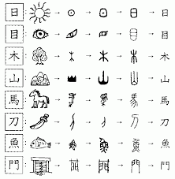
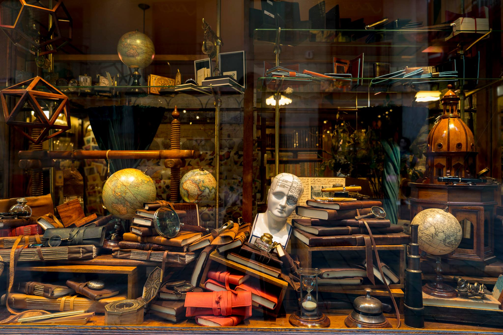

---
hide:
    - toc
---


!!! info "Collective Stories"
    ==FACULTY==:  Laura Benitez
    
    ==CALENDAR==: 06/11/2023

    ==TRACK==: Application

!!! quote 
    <center>
    # **:right_anger_bubble:DIFFERENT WOR(L)DING - WORD THE WORLD BETTER:right_anger_bubble:**

    {: style="height:300px;width:250px"} {: style="height:300px;width:400px"}     


!!!sucess "Narrative"
    !!!info "Personal Narrative"

        > Papirvm Store: Baixada de la Llibreteria, 2 08002 Barcelona, Spain
        <center>
        {: style="height:300px;width:390px"}   {: style="height:300px;width:390px"}
        </center>


        > MagicBook:
        <center>
        {: style="height:300px;width:390px"}   {: style="height:300px;width:400px"}
        </center>
        
        > The Story:

        : I have a habit that whenever I start a new journey, I like to buy myself an interesting magic book (notebook). On this trip to Barcelona, I bought my magic book at a local store called Papirvm. The store is elegant and ancient. The outer layer of this magic book is brown leather , and inside is blank white paper. The entire magic book smells like an old library, which is my favorite scent because when I was young, I used to hide in the school library warehouse and read Shakespeare's comic books (by the way, when I was young, I thought Shakespeare was a woman until I went to Shakespeare's home in England at the age of eleven and found out that he was actually a man. It's really interesting to think about this - as an Asian, I had biases about European people's hair:)). The one who sold me this notebook was an old lady, and all the notebooks in the store were handmade by them, from paper making to sewing into a book. It feels like a connection to a kind of energy, a connection to the spirit of craftsmanship. However, I don't record everything in this magic book, only specific interesting things are recorded in it. I cherish this magic book very much, and I carefully storage it into a packaging bag like a takeout bag.Each page within holds not just words but a magic; a magic connect between past, present and future. 


    !!!info "Group Narrative"
        >:heart:Time Lapse took by Carmen :heart: : 

        {: style="height:480px;width:1080px"}      
        
        >:heart:Handnotes took by Vania :heart: : 

        

        >Possible structure terms: 

        : -One day...

        : -Until...

        : -Then...

        : -The end...

        >Important notes:

        : you cannot use I or We. Neither me, mine, our, ourselves. Myself. So find a way to do it. 
        : Yeah. But you need to be aware about the meaning. So, in terms of if you want to say situated glossary The meaning that you are using or creating for the journal.
        So it's also about speculating, such as for example with this magic machine, also the paradox. So you can use fiction as a tool to write your collective storytelling about these material experiences during these weeks. Or these material entanglements happening during weeks. Sorry, that was not the best figure.

        >Idea: 
        
        : Everyone writes X sentences, then the next person goes and continues the collective story. 

        >The story:
        
        : It is funny how an accumilation of choices can lead a group of people to come together. People who a little more then a month ago were strangers have become a community working to create a better future. Little did they know that the present was gonna be the craziest challenge they ever faced.The members of the group come from diverse nationalities and ethnic backgrounds, yet collectively, they share a common experience of navigating through the intricate processes of attaining city citizenship and utilizing it to acquire a commute card amidst the challenges of bureaucratic procedures. From this primordial soup of individuals and cultures, however, some questions arise: what is really the difference between their personal and professional identities? Are they only here to work together? It seems more like these players are trying to transform their personal ideals into concrete action.

        : The correct answer to the question doesn't exist. It's up to the group to embark on this new adventure and ask even more questions. Whether it's by engaging the newfound tools of the world to act on simple interactions, by analysing the enviroment lived to learn learn and learn or to by simply living in community and add up a new experience of co-living with different cultures, languages, materials, technologies, spaces, species...

        : The journey of this eclectic assembly it's a profound exploration of self within the tapestry of a new society. As they juggle the demands of their individual lives with the collective needs, each member is crafting a unique narrative, shaped by shared struggles and triumphs. This experience may test their limits, but it also offers an opportunity to redefine their understanding of community and identity in an ever-evolving world. The shared adventure forms a community that celebrates milestones, cares for one another, and evolves into a unique system of mutual learning and support.

        : Deep conversations about the future, technology, and all of the possibilities that lie ahead are happening everyday, and it's up to the group to use them to shape the next part of the story.It can be easy to forget, amidst the noise and haste of constant learning and unlearning, of different ways of doing, that having fun is the key. Engaging in ways of exploration and conversation that spark joy and curiosity, lies the groups hidden path to exploring the unfamiliar.This seemingly infinite and endless network, forking and merging, could, through the constant drive to challenge and prove assumptions, gather inspiring experiences for individuals who want to put themselves in this perspective of reality. This means also realizing failure during the process, an indispensable facet of the human experience.Acknowledging failure not as a dead-end but as a portal to enlightenment, one discovers the essence of resilience and adaptability, not only in learning from personal blunders but also in gleaning wisdom from the experiences of others. Failure constitutes an integral facet of the evolutionary journey. Embracing risk is essential for community advancement, and failure is an inherent component of such risks. Within the realm of uncertainty, novel discoveries await, even if accompanied by potential fear and exposure. Valuable lessons emerge from failure, offering a pathway to address topics often neglected or considered taboo. Risk-taking presents opportunities for the existence of these transformative moments shared together. In addition to learning to value failure, this group learned the power of the collective. Learning with each other means learning from one another. Individual design spaces were deeply enriched and expanded by sharing thoughts and ideas with classmates, and many assigments would have never been achieved without collaboration.

        : If in the future one could observe the life paths followed by each of these people from this moment on. And, at the same time one could overlap the paths they would have followed if they had never met in space time.  Maybe, just maybe we would understand a little bit how this experience has shaped their lives. Between the sunrise and the sunset millions questions will shows up to the brain. by answering those question gente used the vision to noticed the informations and solutions. Vision is different in every gente. Nowdays, gente lived with technology. Also, millions creations borned. The new borned babies involved into Gente-Tech Art movement; where the dream starts to come true.

        : Yet, in the midst of continual learning and unlearning, amidst the various approaches, it's easy to overlook that fun is essential. Participating in exploratory conversations that spark joy and curiosity unveils the group's secret journey to explore the unknown. This seemingly boundless and ever-shifting network of connections, with its twists and turns, might, by consistently challenging assumptions, accumulate enriching experiences for those who want to embrace this outlook on reality.

        : Moreover, these diverse experiences and shared challenges of the group risk fading into memory. Documentation,is the useful source to capture the essence of their journey, preserving wisdom from failures and collective learning. It serves as a tangible record, enabling reflection, celebration of milestones, and informed shaping of the group's future.

        : Time will tell how these group of students are going to be changed as professionals and as individual people.But always are going to have the documentation and the learning of the MDEF year This could be an opportunity to explore what it really means to have every opportunity lie ahead. To understand what it means to be one with everything and nothing in the body of a creator. To realise that every miracle once attributed to a god could also be in a group of 22 (sweetie pie) students who all crossed into one reality by making the same decision to be here. 

        >Link to the original writing board: 

        : <iframe name="embed_readwrite" src="https://pad.riseup.net/p/TellingNarrative(s)Stories-keep?showControls=true&showChat=true&showLineNumbers=true&useMonospaceFont=false" width="100%" height="600" frameborder="0"></iframe>

!!!abstract "Classnotes"
    <center>

    !!!note "Personal Narratives"
    ``` mermaid
        graph LR
        A[Personal] --> B[Private/self];
    ```
    ``` mermaid
        graph LR
        A[Narrative] --> B[Tell/relate];
    ```
    ``` mermaid
        graph LR
        A[Narration] --> B[Action/telling a story];
    ```

    !!!note "Story Telling"
    > Act or art of relating stories

    !!!note "Positive Power"
    > Positive/ Affirmative/Empowering = Potencia (the political) **Critique as creativity**

    !!!note "Negative Power"
    > Negative/ Restrictive/ Oppressive = Potestas (the political) **Politics as usual**   

    !!!example "Planetary Scale" 
        #We-are-in-this-together-but-we-are-not-one-and-the-same

        #To-become-in-and-with(in)-the-world

    !!!note "Personal vs. Collective"
        ``` mermaid
            graph LR
            A[Personal] --> B{Copy};
            B -->|Plus/+/| C{Paste};
            C -->|Plus/+/| D{Cut};
        ```

        ``` mermaid
            graph LR
            A[Collective] --> B{Copy};
            B -->|Plus/+/| C{Paste};
        ```    

    !!!note "Narrative vs. Storytelling"
        ``` mermaid
            graph LR
            A[Narrative] 
            A -->|Minus/-/| B{adj.};
        ```

        ``` mermaid
            graph LR
            A[Storytelling]
            A -->|Plus/+/| B{adj.};
        ```    
    !!!question "Problem Solver"
        # **:purple_heart:=Designer	:purple_heart:**

        # **:purple_heart:=Artist	:purple_heart:**

        >Recieving information =={5 senses}==
    </center>
