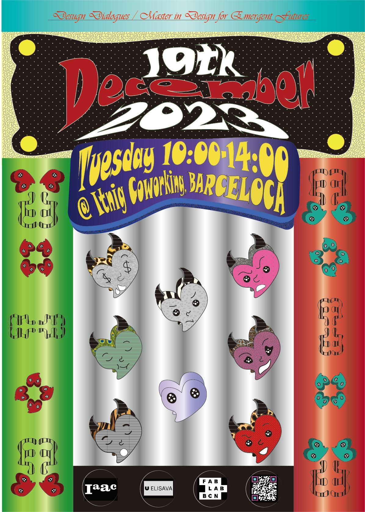
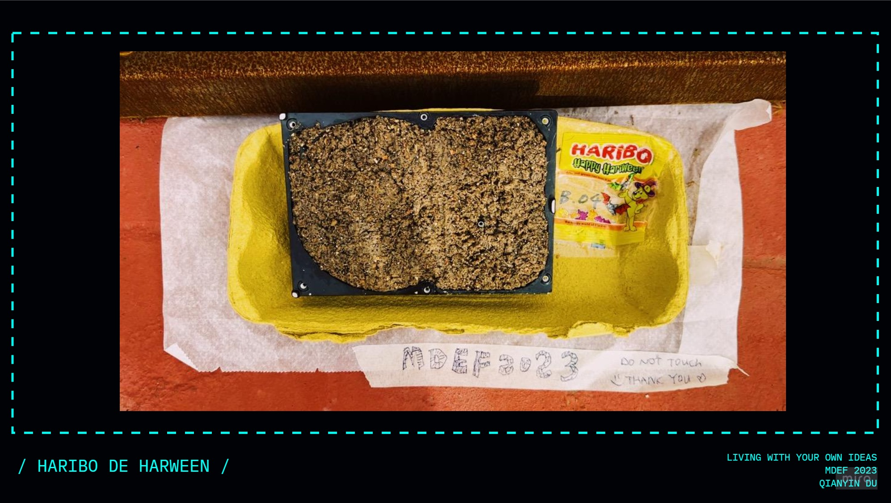
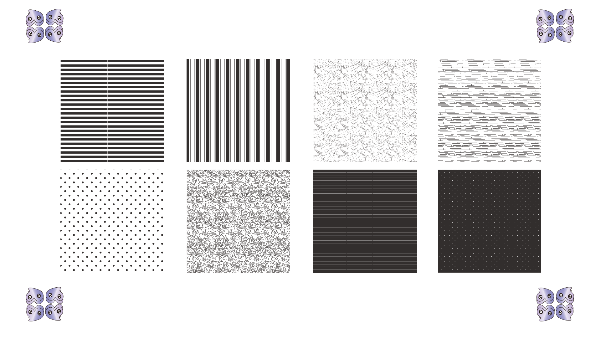
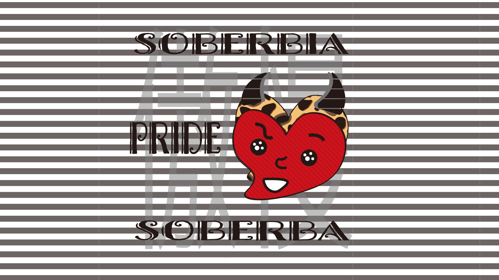
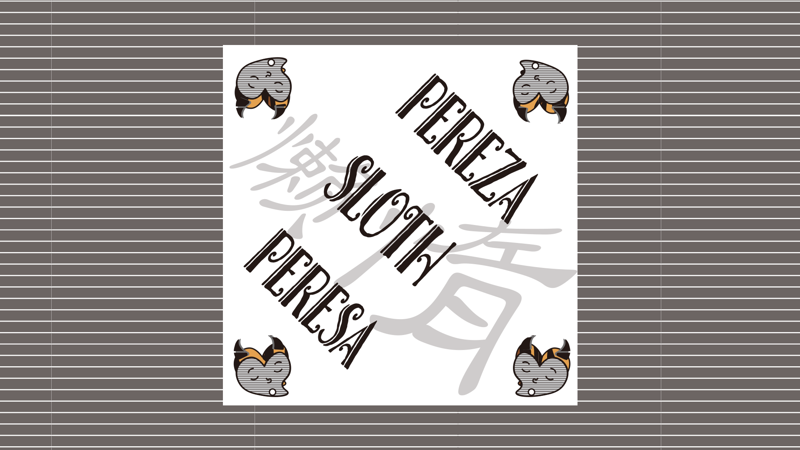
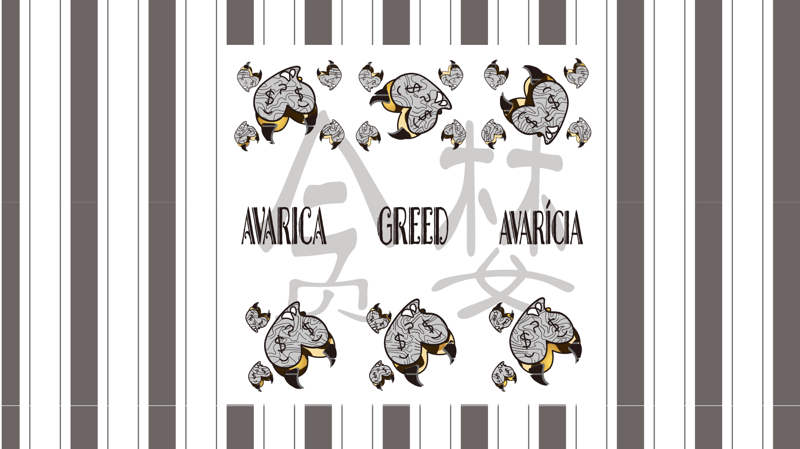
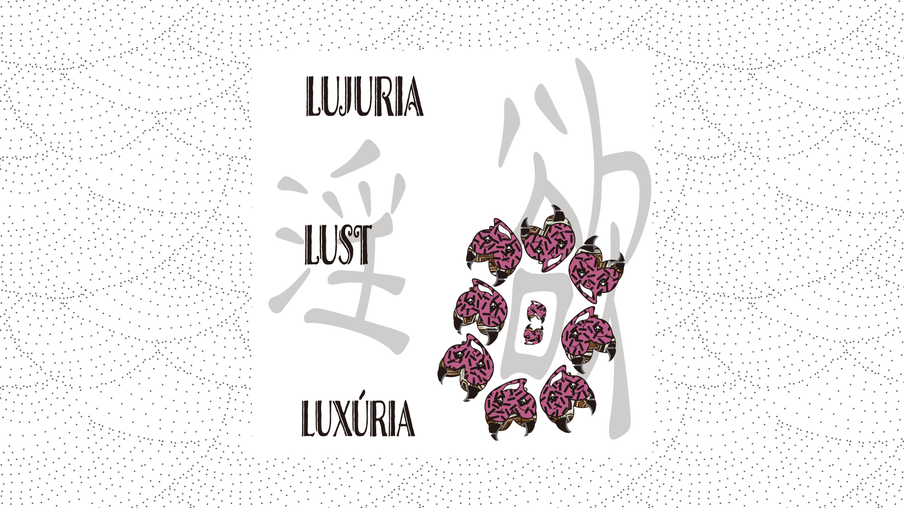

---
hide:
    - toc
---
!!! info "PAST, PRESENT, FUTURE"
    ==FACULTY==: Guillem Camprodon/ Tomas Diez/ Laura Benitez/Jana Tothill Calvo/ Roger Guilemany/ Santiago Fuentemilla Garriga/ Josep Marti Elias/ Petra Garajová/ Adai Surinach
    
    ==CALENDAR==: 11/12/2023 - 19/12/2023

    ==TRACK==: ""SHOWTIME""

    ==KEYWORD==: "7 SINS/ ART THERAPY/ WASTES/ EDUCATION"

!!! quote
    

    ## **:dizzy: NOW, it's our-time to SHINE:dizzy:**
    {: style="height:400px;width:620px"} 

!!! info "Poster"
    

    {: style="height:530px;width:380px"}        {: style="height:530px;width:380px"}

    !!!info ""
        ## Comments box for **:hole: Past/Present/Future :hole:**
        

        {: style="height:500px;width:780px"}
        
        

    

        * **The comments paper was a side waste collected from a print shop** ( IMPRESIÓN, DISEÑO Y COLOR,  Carrer de Fluvià, 217, BAJOS, Sant Martí, 08020 Barcelona )
        
        * **The comment container was a waste water bottle.**
        >I got a lots of comments/feedback/debates: **:heart:From MANY AMAZING PEOPLE BIG LOVE BIG THANKS :heart:** 

!!! question "GOAL"
    ==Dialogue is a written or spoken conversational exchange between two or more people. It is a literary and theatrical form that depicts such an exchange.==
    ==DEBATE==

    !!! note "Awake:"

        - Select the pieces that communicate your work during the semster

        - See how can be display pieces in connection to the others

        - Communication the result. 

        > A space to have communication

        > Beware of information saturation

        > Enable feedback collection

    !!!success "2.0 version"
        

        >Declaration: 
        # **:hole: Past/Present/Future :hole:**

        !!!info ""
            

            !!!warning ":black_heart:PAST:black_heart:"
                {: style="height:350px;width:600px"}

                > Link to the past: https://33dudu.github.io/magicreator/term1/06-Living%20With%20Your%20Own%20Ideas/

                The main idea was to use the past/present/future as a strategy for this design dialogue. Let's start with the past—a seminar during school focused on 'Living with Your Own Ideas.' I questioned myself about the biggest waste in my personal lifetime, which turned out to be coffee powder, eggshells, and paper. Combining them, I created a new type of recycled paper to draw on. However, my ambition led me to use this recycled paper to make waterproof art, envisioning dolphins in the ocean appreciating my work(THE FURTURE DREAM).

                During class time in the MDEF classroom, I discovered a new waste from machine—discarded disks. I used these disks as molds or as a "brain" for my projects. Imagining the future, I envisioned placing these waste art pieces in my home. Proudly introducing them to my friends, I would say, 'Look, guys, these art pieces are made from trash.'"

            !!!info ""
                

                > Comments for THE PAST

                {: style="height:300px;width:480px"}

                > Comments Research(IN PROGRESS):  

                ## 1. Tracey Emin: 
                
                https://www.whitecube.com/artists/tracey-emin
                    
                https://www.artnet.com/artists/tracey-emin/

                ## 2. Celt + Gaelic Culture/ Rome Stone:

                ## 3. Material Culture Evolotion:

    !!!info ""

        

        !!!warning ":purple_heart:PRESENT:purple_heart:"

            ## **:seven:SINS :link: LINKS :seven: WASTES**

            {: style="height:500px;width:300px"}
            {: style="height:500px;width:300px"}

            {: style="height:500px;width:300px"}
            {: style="height:500px;width:300px"}

            !!! example ":hole:Card-Game:hole:"
                

                
                > Pick up a card that speaks to you :smile:

                **Before you pick a card, think and read the pattern carefully. There are 8 cards but 9 choices. One of them has a prize: which is 5 euros for you.**

                {: style="height:300px;width:450px"}

            !!! example ":eye:Answer:eye:"
                

                > The prize is the Angel (天使). If you can read Chinese, you will got the answer more easily.

                {: style="height:300px;width:450px"}

            !!!info "1"
                {: style="height:300px;width:450px"}
                        
                **Pride (傲慢)**
                > Excessive belief in one's abilities or status, often leading to arrogance and a disregard for others.

                - Excessive Packaging

                - Fast Fasion            

            !!!info "2"
                {: style="height:300px;width:450px"}

                **Envy (嫉妒)**
                > Feeling discontent or resentful towards others' success, possessions, or advantages.

                - Abandoned Technological devices
                - Abandoned DIY projects   

            !!!info "3"
                {: style="height:300px;width:450px"}

                **Wrath (暴怒)**
                > Intense and uncontrolled anger, often leading to harmful actions or words.

                - Graffiiti/street stickers
                - Broken Glass  

            !!!info "4"
                {: style="height:300px;width:450px"}

                **Sloth (懒惰)**
                > Avoiding responsibilities, being lazy, or lacking the motivation to do what needs to be done.

                - Smoke butt
                - Relate items

            !!!info "5"
                {: style="height:300px;width:450px"}

                **Greed (贪婪)**
                > Having an insatiable desire for more possessions, wealth, or power, without contentment.

                - Mula
                - Recipit
        
            !!!info "6"
                {:style="height:300px;width:450px"}
                    
                **Lust (淫欲)**
                > Excessive desire, especially inappropriately strong desires, not just limited to sexual desire.
                - Sexual Magazines
                - Love letter

            !!!info "7"
                {: style="height:300px;width:450px"}
                        
                **Gluttony (贪食)**
                > Consuming more food, drink, or resources than necessary, often to the point of waste.

                - Food Waste
                - Waste Chopsticks/ Straw

            !!!info "8/9"
                {: style="height:300px;width:450px"}
                        
                **(魔鬼) (天使)**

                > This card is the most exciting one in the entire game. However, holding this card doesn't guarantee success because it has two possibilities. One side is the Devil, and the other side is the Angel. Only when the card of Angel (天使） is facing you, you are the winner. This may be challenging for many people who don't understand Chinese, but it is also the part I find most mysterious. While I've provided translations in English, Spanish, and Catalan for other cards, this particular card is in Chinese only.
                
                {: style="height:300px;width:500px"}

        > Comments for THE PRESENT

        {: style="height:300px;width:480px"}

        !!!info ""
            !!!warning ":love_letter:FUTURE:love_letter:"
                

                In the upcoming phase, I challenged myself to step out of my comfort zone. I want to express my gratitude to Tomas for awakening me. Initially, I was merely attempting to create an internal space for Dialogue Day. However, during my conversation with Tomas, he pointed out a crucial issue. Subsequently, I introspected and identified my weak point, which turned out to be technology.

                In an effort to address this, I explored the MDEF classroom and sought out abandoned machines that resonated with me. Ultimately, I settled on an old 80s TV. My goal was to connect it to my iPhone 14 Plus. After several attempts and searches, I succeeded. Upon inspecting the connectors, it felt surreal to witness the integration of this ancient machinery with the latest technology. **It's a conversation between history and the present, symbolizing a bridge between the past and the future.**

                

            !!!info ""
                {: style="height:400px;width:260px"}        {: style="height:400px;width:550px"}      

                :heart:Learning the 80s TV :heart:

                **Name:**: 7.0" BLACK/WHITE TELEVISION 

                **SYSTEM:** CCIR B/G SYSTEM

                **Serial number:** J1 013493

                **Brand:** SUPERTECH

                **Model:** BTV-707

                **Weight:** 2.532 Kg

                **Colour:** BLACK/GREY

                **Made in:** GERMANY

                **Funiculus umbilicalis:**

                {: style="height:300px;width:460px"}

            
            !!! info "Video"
                <iframe width="560" height="315" src="https://www.youtube.com/embed/Y9UEMxQ6CSA?si=R4gBsE4zbkEQrDnI" title="YouTube video player" frameborder="0" allow="accelerometer; autoplay; clipboard-write; encrypted-media; gyroscope; picture-in-picture; web-share" allowfullscreen></iframe>

                > Comments for THE FUTURE

                {: style="height:500px;width:300px"}

        

!!!info ""
    !!!example "Inspirations"
        Catalan Modernisme:
        > more information :https://33dudu.github.io/magicreator/cat/

        Street Art:
        > more information :https://33dudu.github.io/magicreator/

    !!!failure "1.0 version" 
        >Declaration: 
        
        This is an excellent opportunity for me. With a background in art history and interior architecture design, it seems like the perfect fit for a standard curator role. Perhaps my goal could be to design an interior exhibition space that serves as a culmination of my current stage also helping my classmate to organize the space. I intend to draw inspiration from Catalan modern architecture and street art.
    
        >Feedback From Tomas 2023/12/11
        
        - A statement;A content, not a container, 
        - What is the information do you want to show(not an object in the space, how can this declaration of your information)?
        - Maybe design(fabrication) an experimental space. that connect people together, link it. experiences.
        - What is Gente-tech art movement( contented behind)
        - What data(feedback) do you want to collect?
        - Try not to avoid the conflicts
        - What do you want to do with the aesthtics? 
        - Explain the movement?how can you do this. (Look other movement, how did they start? Vision is from two sde (good/bad).
        - ## ==DO NOT== PUT YOURSELF IN THE ==SAFE ZONE==. Go to THE ==UNKNOWN ZONE==
        - Performance on your self
        - Designing with decicions 

        !!!info "Design Dialogues Plan"
        > More information about the space: https://theflexroom.spaces.nexudus.com/files/Itnig%20Coffice%20events%20SP.pdf

        > More information to the class share MIRO board:
        https://miro.com/app/board/uXjVNG7pSuE=/

        
        >:heart: Floorplan will made by me, Flora & 4ever for 12/19/2023 :heart: : 

            
        !!! example ""
            Experiment
            -poker table
            -canvas 
            -decro

        !!! example ""
            Art therapy

        !!! danger "Speakeasy"
            >Find the secrete spot and enjoy the space in there

            - Cover with fabric
            - Inside is the 80s TV & beanbag & Light 

!!!info "References"
    https://labs.rs/en/facebook-algorithmic-factory-immaterial-labour-and-data-harvesting/

    https://publiclab.org/notes/homechemist/08-24-2018/diy-high-resolution-spectrometer

    https://romi-project.eu/

    https://en.wikipedia.org/wiki/Adversarial_Design

    https://en.wikipedia.org/wiki/Lewis_Mumford

    https://www.goodreads.com/en/book/show/688489

    Art therapy: https://en.wikipedia.org/wiki/Art_therapy