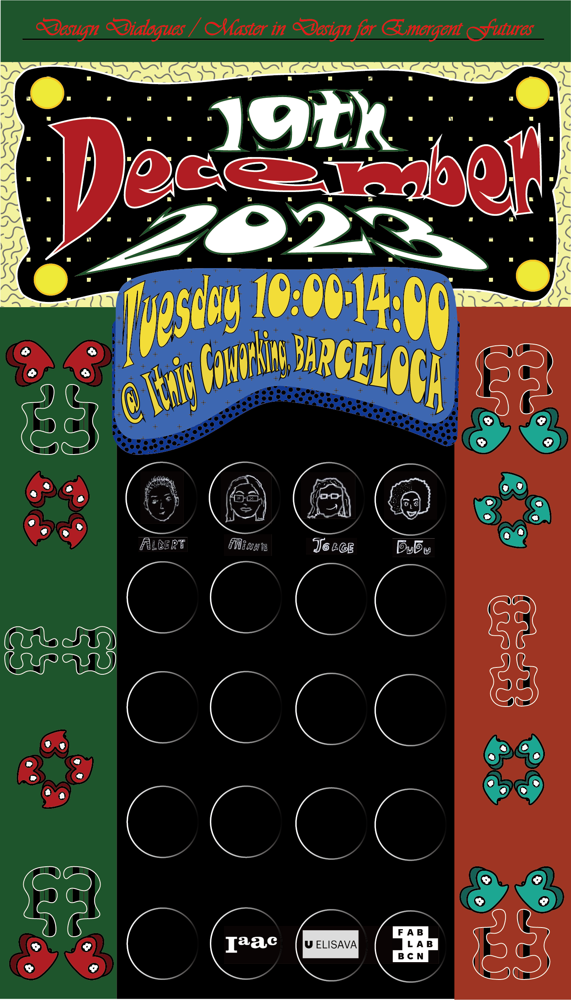

---
hide:
    - toc
---

!!! info "Design Dialogues"
    ==FACULTY==: Guillem Camprodon/ Tomas Diez/ Laura Benitez/Jana Tothill Calvo/ Roger Guilemany/ Santiago Fuentemilla Garriga/ Oscar Gonzalez/ Josep Marti Elias/ Petra Garajová/ Adai Surinach/ Mikel Llobera
    
    ==CALENDAR==: 11/12/2023 - 19/12/2023

    ==TRACK==: ""SHOWTIME""

!!! quote
    

    ## **:dizzy: NOW, it's our-time to SHINE:dizzy:**

!!! question "GOAL"
    This is an excellent opportunity for me. With a background in art history and interior architecture design, it seems like the perfect fit for a standard curator role. Perhaps my goal could be to design an interior exhibition space that serves as a culmination of my current stage also helping my classmate to organize the space. I intend to draw inspiration from Catalan modern architecture and street art.

!!!info "Design Dialogues Plan"
    > More information about the space: https://theflexroom.spaces.nexudus.com/files/Itnig%20Coffice%20events%20SP.pdf

    > More information to the class share MIRO board:
    https://miro.com/app/board/uXjVNG7pSuE=/

    
    >:heart: Floorplan will made by me, Flora & 4ever for 12/19/2023 :heart: : 

    !!! note "Awake:"

        - Select the pieces that communicate your work during the semster

        - See how can be display pieces in connection to the others

        - ==Uplade my design space. Print an A2==

        - Communication the result. 

        > A space to have communication

        > Beware of information saturation

        > Enable feedback collection

!!!example "Inspirations"
    !!!example ""
        Catalan Modernisme:
        > more information :https://33dudu.github.io/magicreator/cat/

        Street Art:
        > more information :https://33dudu.github.io/magicreator/

!!!danger "SHOW-OFF"
    !!! info "Front/Back"
        

        {: style="height:330px;width:200px"}              {: style="height:330px;width:200px"}   
        
   

        > GenteCH Art Movement: more information: https://33dudu.github.io/magicreator/project/gente/

        > gente graphic inspired by BINGO project, more information :https://33dudu.github.io/magicreator/term1/Intervention%2001/

