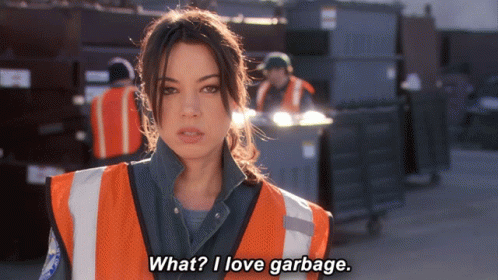
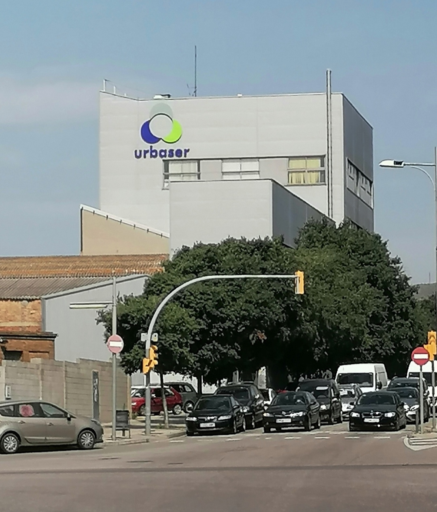
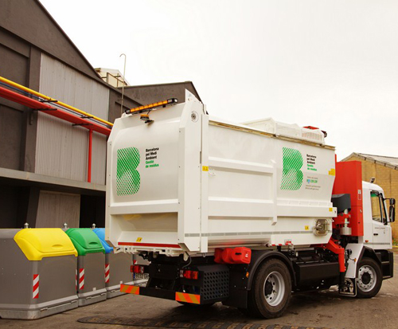
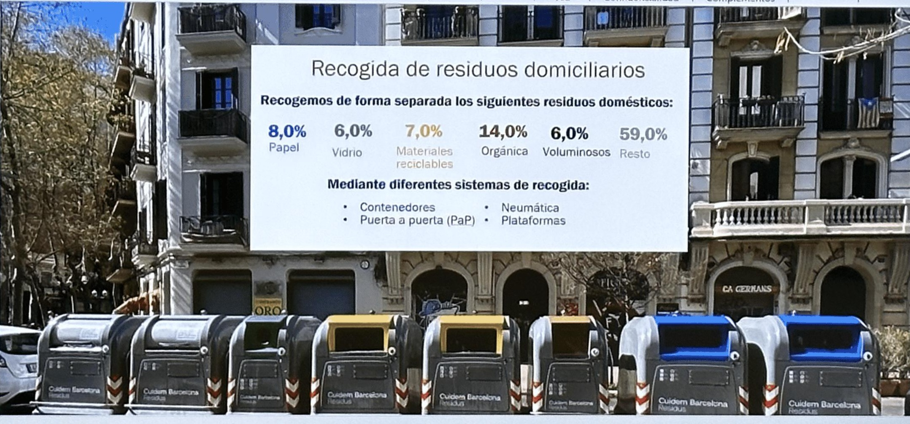
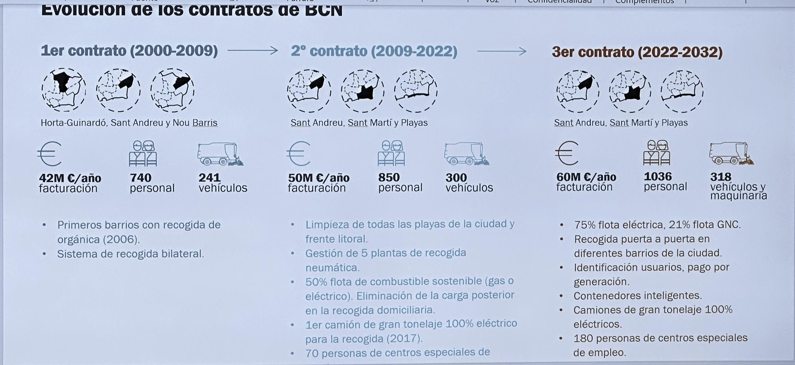
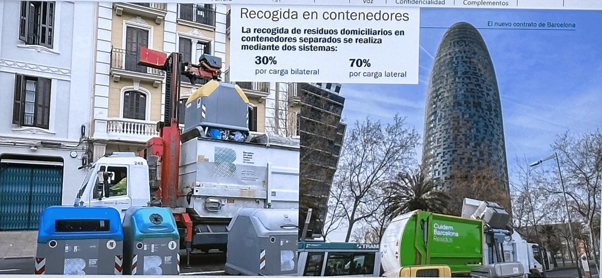

---
hide:
    - toc
---
!!! info "BINGO"
    ==FACULTY==:Guillem Camprodon/ Tomas Diez/ Jana Tothill Calvo/ Roger Guilemany
            
    ==CALENDAR==:  30/10/2023 - 06/11/2023

    ==TRACK==:Instrumentation

    ==TEAM MEMBERS==: Albert Vila Bonfill/ Jorge De la Mora/ Qianyin Du/ Emmanuel Pangilinan

    Intervention

!!! quote
    
 
    # **:boom:  :boom:**
    {: style="height:300px;width:430px"}

!!! success "Trip"
    

    **:green_heart: Big thanks to Albert for bringing us an amazing opportunity to visit the Urbaser company. :green_heart:**

    ## Link to **Urbaser**: https://www.urbaser.com/en/

    {: style="height:300px;width:330px"}
    {: style="height:300px;width:330px"}

    !!!info ""
    ## **Data share from Urbaser**
    

    {: style="height:300px;width:430px"}
    {: style="height:300px;width:430px"}
    {: style="height:300px;width:430px"}
    {: style="height:300px;width:430px"}

    !!!info ""
    ## **Green Roof run by Mr. Joan Bosch**

    !!!info ""
    ## **Infographics**

    Link to https://tome.app/jdlm-24d/barcelonas-waste-management-system-clom2go2g0ulqmy7cbr94ra6x

    {: style="height:680px;width:500px"}

!!! info ""
    

    !!!tip "Team"
        {: style="height:300px;width:300px"}

    !!! tip "LOGO"
        # **:slot_machine: ==BIN== ==GO== you got it right :slot_machine:**

        {: style="height:300px;width:400px"}
        {: style="height:300px;width:400px"}

    

    !!!abstract "Test01"
        **MAIN USER**
        
        PEOPLE WHO LOVE RECYCLING AND SUSTAINABLE BUT DIDN'T DO IT WHAT REALLY REALLY HELPING THE ENVIRONMENT or A PERFECT WAY.

        !!!info ""
            ## **:robot:SOFTWARE ATTRACTION:robot:**
            
            !!!danger "TRICK"
                PSYCHOLOGY: PEOPLE LOVE THINGS THAT HAS VALUE TO THEM
            
            !!!example "TREAT"
                EX: MONEY? NUMBER OF POINTS?FREE STUFFS?

        !!!info ""
            ## **:revolving_hearts:WIN-WIN/DOUBLE-WIN:revolving_hearts:**
            
            !!!danger "TRICK"
                HOW CAN WE ALSO SATISFY THE DESIER OF GARBAGE COMPANY?
            
            !!!example "TREAT"
                EX: HELP THEM REDUCE THE EXPEND OF SALARY?

        !!!info ""
            **WORKFLOW DIAGRAM**
            

!!!failure "BOT"
    
    > "One of the ideas we had was to make a bot in Telegram. Unfortunately, since this is the first time I’ve tried coding one, we were not able to make it work."

    > :love_letter:By minnie:love_letter: 

    {: style="height:400px;width:280px"}

!!! bug "Videos"
    

    <iframe width="560" height="315" src="https://www.youtube.com/embed/63wQEw63Clg?si=5jrkT2HCHikUrOrK" title="YouTube video player" frameborder="0" allow="accelerometer; autoplay; clipboard-write; encrypted-media; gyroscope; picture-in-picture; web-share" allowfullscreen></iframe>

!!!abstract "Feedback" 
    from Tomas 

    11/13/2023

    >We should not design a solution, the solution will shows up by itself once we work with the society and the community.

    >We should work outside of the "BUBBLES" (means ourselves). 

    >We should not only seating infront of our computer or desk. 

    >We should go outside, get the information, get the feedback, get the problem, test the problems.