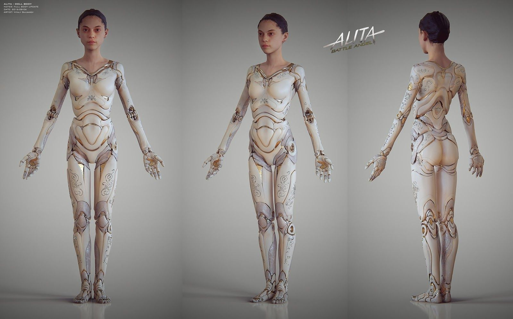
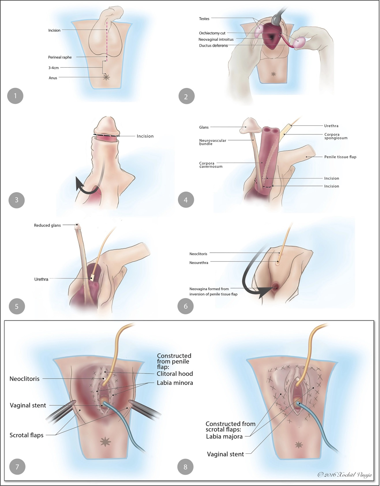
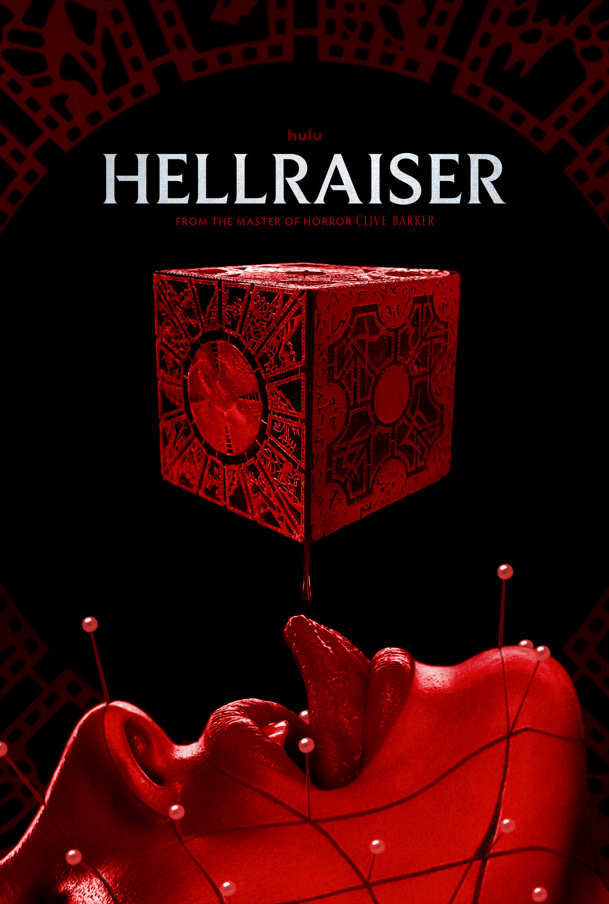

---
hide:
    - toc
---


!!! info "CyberUnion"
    ==FACULTY==: Guillem Camprodon/ Tomas Diez/ Laura Benitez/Jana Tothill Calvo/ Roger Guilemany
    
    ==CALENDAR==: 20/11/2023 - 27/11/2023

    ==TRACK==: Application

    ==TEAM MEMBERS==: Ana Lozano/ Vania Belen Bisbal Villacorta /Anna Fedele / Qianyin Du/ Emmanuel Pangilinan


!!! quote "Quote"

    <center> 
    ## **:alien:Everyday Halloween, Until Halloween** :alien:
    </center>

    !!! note "2023/11/27"
        

        - #**Transhumanisms**

        Transhumanism is the position that human beings should be permitted to use technology to modify and enhance human cognition and bodily function, expanding abilities and capacities beyond current biological constraints. Transhumanism is characterized by a set of core values emphasizing positive experience and recognizing the limitations of human cognition and embodiment in achieving maximally positive experience. A set of nonnecessary but common secondary values and positions associated with transhumanism include individualism, libertarianism, pragmatism, and physicalism. Influenced by Enlightenment ideals, transhumanism has been criticized from a variety of perspectives, including those religious and secular and those socially conservative and socially liberal


    !!! abstract "Brainsheet"
   

        > let's think about a different perspective 

        * ==Situating==: 
            * understanding surroudings

        * ==Organization==: 
            * reduceing complexity
            * making sense
            * connection arise

        * ==Narrative==:
            * take a step back
            * undersand your own narrative 
            * through the diverse conversations

        * ==Performa-tive or Practicipa-tive==：
            * combine design spaces- "collaboration design spaces
            * performative as giving ==feedback== to oneself

        * ==Inspiration==:
            * bring together

        > Here is the movement
        
        <center> 
        ```mermaid
            graph LR
            Abstract --> Actual
        ```

        ```mermaid
            graph LR
            WeakSignal --> EmergentsFutures
        ```

        ```mermaid
            graph LR
            Actions --> AlternativePresents
        ```
        </center>

    !!! tip  " <font color="white">**QUESTION**"
        <center>
        
        Why do we want to ==change/modify== our body?   

        Because you are not ==satisfy== your body? 

        Because your body is too ==weak== ?

        Because your body does not ==match== your identity?

        ...
        </center>

    !!! info "Examples:"

        > - ##**Changing Outlook**: 


        > ##==By adding item on==

        >- Insole

        >{: style="height:573px;width:620px"}</center>

        >- Nail

        >- teeth

        >- tattoo

        >- cloth
    
        >- ##**Changing power**: Super-Power 

        >### =="Alita: Battle Angel"==  is a 2019 science fiction action film directed by Robert Rodriguez and produced by James Cameron. The film is based on Yukito Kishiro's manga series "Gunnm," also known as "Battle Angel Alita." The screenplay was written by James Cameron and Laeta Kalogridis. The movie is set in a post-apocalyptic future and follows the story of Alita, a cyborg who is found in a scrapyard by Dr. Dyson Ido, played by Christoph Waltz. Alita has lost her memory but retains her incredible combat abilities. As she navigates the dangerous world of Iron City, she discovers her past and confronts powerful forces. 

        > <center> {: style="height:425px;width:300px"}

        > https://www.imdb.com/title/tt0437086/
        </center>

        

        >###The film features a mix of live-action and computer-generated imagery (CGI) to bring the futuristic world and its characters to life. Rosa Salazar portrays the titular character, Alita, using motion capture technology to create a realistic and expressive CGI character.

        >### "Alita: Battle Angel" received praise for its visual effects, action sequences, and the portrayal of the main character. However, opinions on the film were mixed, and it didn't achieve massive box office success. Despite this, the movie has gained a dedicated fan base and sparked discussions about the possibility of a sequel. As of my last knowledge update in January 2022, there hadn't been official announcements regarding a sequel, but plans for a follow-up were discussed by the filmmakers and fans.
        

        >{: style="height:388px;width:600px"}</center> 

        >{: style="height:388px;width:350px"}</center> 
        >{: style="height:388px;width:240px"}</center> 

        > - ##**Changing identity**: male-female gender transform

        >{: style="height:388px;width:300px"}</center>
        >{: style="height:388px;width:300px"}</center>

        > - ##**Changing Spirit**: 


        {: style="height:388px;width:300px"}
        {: style="height:500px;width:280px"} 
        {: style="height:388px;width:320px"} 

        =="Hellraiser"== movie series includes a range of unique characters and elements that collectively create a distinct and horrifying atmosphere. Here are some of the main characters and elements:

        **Pinhead:**
        - Pinhead is one of the most iconic characters in the "Hellraiser" series, portrayed by actor Doug Bradley.
        - Initially a human named Captain Elliot Spencer, Pinhead was transformed into a Cenobite by the forces of Hell. He is known for his appearance with a head full of metal nails and is one of the leaders of the hellish creatures.

        **Cenobites:**
        - Cenobites are supernatural beings from Hell, governed by the god-like entity of Hell. Their task is to guide humans seeking extreme experiences in exchange for the enjoyment of their souls.
        - Cenobites have twisted appearances, often adorned with various metal and sharp objects.
            
        **Lament Configuration:**
        - The Lament Configuration is a mysterious box, also known as the puzzle box or the box of Hell. Humans unwittingly summon Cenobites by solving this box, often without understanding the consequences of their actions.

        **Hell and Dimensional Gateways:**
        - The entire "Hellraiser" series revolves around the concepts of Hell and dimensional gateways. Unlocking the Lament Configuration typically opens a gateway to Hell, summoning Cenobites.

        **Human Characters:**
        - In addition to supernatural elements, the films also involve human characters, some of whom seek Hellish experiences willingly, while others become victims influenced by Cenobites.

        {: style="height:300px;width:420px"}
        {: style="height:300px;width400px"}

!!! tip "<font color="white">Final Video"
    <iframe width="560" height="315" src="https://www.youtube.com/embed/8jj0FoZHYX0?si=oKZAbOpZxRJyl2t5" title="YouTube video player" frameborder="0" allow="accelerometer; autoplay; clipboard-write; encrypted-media; gyroscope; picture-in-picture; web-share" allowfullscreen></iframe>


!!!info "References"
    ~~Diagram code templet~~
    ``` mermaid
        graph LR
        A[Start] --> B{Error?};
        B -->|Yes| C[Hmm...];
        C --> D[Debug];
        D --> B;
        B ---->|No| E[Yay!];
    ```

    https://www.sciencedirect.com/topics/social-sciences/transhumanism#:~:text=Transhumanism%20is%20the%20position%20that,capacities%20beyond%20current%20biological%20constraints.
    https://krismehaffey.com/
    https://hellraiser.fandom.com/wiki/Pinhead
    https://www.zbrushcentral.com/t/alita-battle-angel-gunnm/406445
    https://revistaidees.cat/en/the-technological-singularity-and-the-transhumanist-dream/