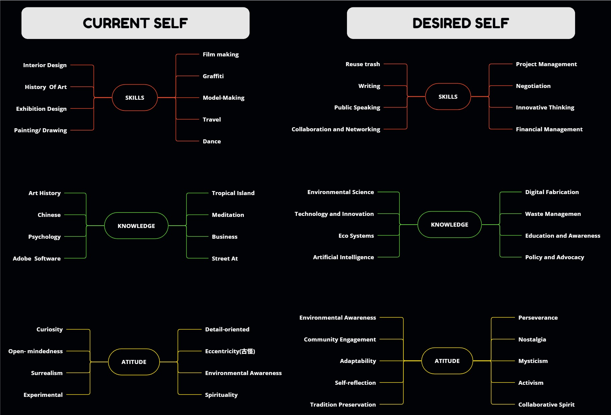

---
hide:
    - toc
---
# GENTE Art Movement

!!! question "Introduction"

    _1. WHAT IS YOUR PURPOSE?_

    !!! note ""
        To be honest, I have never known what my purpose is; I've simply gone with the flow and pursued my passions. However, one thing I am certain about is my love for tropical islands, nature, and my dislike for city lifestyle. I aspire to contribute to initiatives that benefit people in natural settings, whether it involves addressing the issue of waste or exploring technological solutions. 
                
        **In essence, my primary goal is to protect and preserve tropical islands, whether through addressing waste issues, exploring technological solutions, or contributing in diverse ways to ensure their long-term well-being.**
        

        {: style="height:300px;width:290px"}
        {: style="height:300px;width:290px"}
        {: style="height:300px;width:290px"}

        {: style="height:300px;width:290px"}
        {: style="height:300px;width:290px"}
        

        > Prompt generated by CHATGPT: **the original information wrote by DUDU**

        > Generate visual representations inspired by my passion for tropical islands, nature, and commitment to their preservation. Capture the essence of waste management initiatives, technological solutions, and diverse contributions aimed at ensuring the long-term well-being of tropical islands. Illustrate scenes that reflect the beauty of these natural settings and the integration of sustainable practices. Feel free to showcase the harmony between technology, nature, and the community as part of the efforts to protect and preserve tropical islands."

        

    _2. VISION AND IDENTITY_
    !!! info ""
        

!!! question "Research through Design Toolbox"

    _1. Reflect which **Roles of Prototyping in 1PP Research through Design** you have used in the past?_
    
    !!! note ""
        > ROLE 1: The prototype as ==Experimental Component{self-test}==
            
        **Bingo**

        - https://33dudu.github.io/magicreator/term1/Intervention%2001/

        - https://33dudu.github.io/magicreator/term1/12-Extended%20Intelligences/

        **Street Art**

        - https://33dudu.github.io/magicreator/

        **Catalan Modernism**

        - https://33dudu.github.io/magicreator/cat/
        
    !!! note ""
        > ROLE 2: The prototype as a means of ==Inquiry{asking question}==

        **Design With Others**

        - https://33dudu.github.io/magicreator/term1/09-%20Design%20With%20Others/

        **Extended Intelligences**

        - https://33dudu.github.io/magicreator/term1/12-Extended%20Intelligences/

    !!! note ""
        > ROLE 3:
        The prototype as a research archetype ==Examplary&Illustrative{"show-off"}==

        **Gente ArtMovment**

        - https://33dudu.github.io/magicreator/project/gente/

        **Living With Your Own Ideas**

        - https://33dudu.github.io/magicreator/term1/06-Living%20With%20Your%20Own%20Ideas/

        **Design Dialogues**

        - https://33dudu.github.io/magicreator/term1/Design%20Dialogues/#now-its-our-time-to-shine

    !!! info ""

        > ROLE 4:
        The prototype as a ==Vehicle for inquiry{asking question by makking it}==

        !!!note "Jamaica Balls"

            !!! note ""
                

                **:footprints:Gente:footprints:**: DUDU/ Yaadi

                **:date:CALENDAR:date:**: 2023/12/24-2024/01/03

                **:camera:Medium:camera:**": Sony APS-C
                
                **:world_map:Location:world_map:**: Jamaica

            Every single one in this earth love the **pretty things**, then what about the **ugly things**? Let me give a try to solve this bug. 

            **BUG**: How to solve the trash and either make it to a functional or aesthetic. To let the ==Pretty== & ==Ugly== to stay at a balance. 

            > It was nice to have the winter break spent in Jamaica. It helped me enlarge my perspective on seeing the world and rethink about the environment and waste. Several weak signals in Jamaica:

            **Waste Management Observations:**

            1. The understanding of waste/trash is different compared to the city:
                - For example, people in the city will throw the garbage into the trash can, and the trash company will help us deal with that waste. But people in Jamaica, who live in nature, will burn the trash/garbage. So, considering the pollution or health situation from burning plastic just right next to you while playing dominoes or swimming in the river.
                - Also, the age of the trash: People living in the city will throw away new plastic or trash immediately after they finish using it. But people I met in Jamaica will reuse the waste.
                - (Can we design a machine that can dissolve and break down the waste in the local neighborhood and print it as a new usable thing?)

            2. The ecosystem is amazing in Jamaica, its the gift from the sky, so when I saw a garbage mountain in the middle of amazing envirnoment, my heart start break down. 

            **Noise Pollution from Sound Systems:**

            2. A good point from Jamaican teenager Chris: The issue of sound pollution from sound systems."

                - _Impact on Community Well-being:_ The Jamaican teenager mention of sound systems and noise pollution highlights a potential environmental concern. Balancing the cultural significance of events with the well-being of local communities is crucial.

            **Lack of technological skills**

            - I couldn't help but notice the genuine curiosity people have about technology. It's amusing that whenever someone saw my phone, the first question was always, "Which iPhone is this?" Despite this interest, there's a twist – many locals face a challenge as they lack both knowledge and financial means to actively engage in societal activities.

            - It's interesting to witness the excitement people have for modern gadgets, especially iPhones. However, the reality is that not everyone can fully dive into technology due to limited resources and knowledge.

            - The mix of curiosity and limited access to information and financial resources creates a unique situation. There's interest, yet the pace of life seems laid-back, possibly because not everyone can fully participate in the digital world.

            - My experience in Jamaica raises questions about the connection between technology, knowledge, and socioeconomic factors. How can we bridge the gap and empower communities to be more actively involved in the digital age? Initiatives focusing on digital literacy or making technology more accessible could play a significant role in creating a more inclusive and engaged society.

        - Bali

    _2. Reflect on your own RtD toolbox based on your vison and identity. Select the **main roles of prototyping** and other design activities that you want to use based on the contect you are in._
    !!! note ""
        > ROLE 3:
        The prototype as a research archetype ==Examplary&Illustrative{"show-off"}==

        > ROLE 4:
        The prototype as a ==Vehicle for inquiry{asking question by makking it}==

    _3. In order to better understand and position yourself in your current space, locality and context, you can make a visual inventory of **tools, spaces and materials** you can work with and add a few lines reflecting on it._

    !!! note ""
        - FAB LAB
        - Computer
        - L’Ateneu de Fabricació de Gràcia :https://ajuntament.barcelona.cat/ateneusdefabricacio/ca/ateneu-de-fabricacio-de-gracia/
        - Wasted collected from restaruant

!!! question "Framing a personal and a collective Design Space based on AoWS, Multiscalar Design Space and State of the Art. Personally reflect on your area of interest and areas of intervention."
    !!! note ""
        **1.0 AWoS**

        - https://33dudu.github.io/magicreator/term1/02-Atlas%20of%20Weak%20Signals/
    
    !!! note ""
        **2.0 AWoS**

        - In Progress

    
!!! question "Communication Strategies, Formats and Roles for Open Design Processes."
    a) Include the deliverable for the session “Personal narratives, collective storytelling. Forms of 1PP Documentation and Communication.” Reflect on how to put it in practice.
    !!! note ""
        - https://33dudu.github.io/magicreator/term1/Collective%20Stories/

    b) Reflect on the communication strategy that best suits the needs you have right now in your research and the ones you could explore for the next stages of your project.

