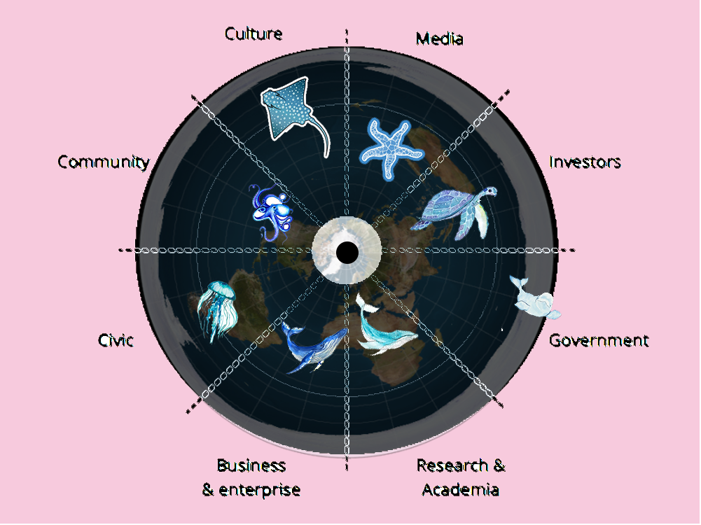
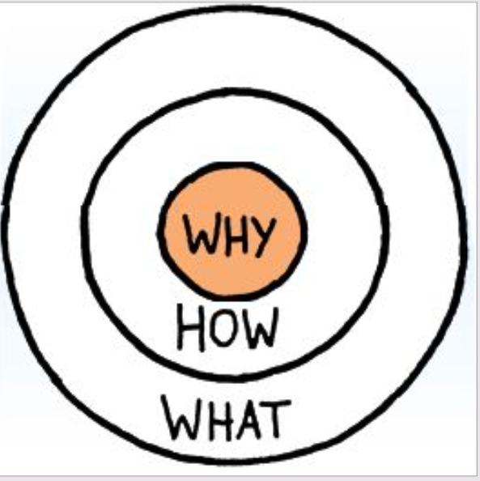

---
hide:
    - toc
---

!!! Warning "HAPPENING"  
    
    #IN PROGRESS

!!! info "Communicating Ideas"
    ==FACULTY==: Pablo Zuloaga Betancourt
    
    ==CALENDAR==: 16/01/2024 - 27/02/2024

    ==TRACK==: Reflection

    ==KEYWORDS==: Storytelling, Communication, Narrative

!!! tip ""
     

    ## :green_heart:Stakeholders Radar 

    {: style="height:400px;width:520px"}

    !!!tip ""
        

         

        {: style="height:400px;width:550px"}
        

         

         
        ## :question:What is **WORLD**:world_map:
            
        ## From my perspective YIN&YANG would be the best word to describe the :white_circle::black_circle:**WORLD**:black_circle::white_circle:. The background on the left side is a trash mountain. But the TRA:moneybag:H with the hidden gold. Additionally, THE EYE, which has a shapeless-harmful effect, represents Mr. SOUNDs system:level_slider:. On the right side is the tropical island where i feel like a HOME:heart_white:, and my cutie TRA:moneybag:H friendssssss~~

        ##  :question:What do we do 

        !!! info ""
            My focus will be on tropical islands; any tropical island will be one I want to help because I love summer too much. It's not just for nature but also for the people living in that territory, helping them address issues we don't frequently encounter in the city. For example, this winter holiday, I went to Jamaica and discovered three main problems: the accumulation of plastic waste, incorrect incineration methods, and noise pollution from the sound system.

        ##  :question:How do we do it 
        !!! info ""
            If we are dealing with local residents, based on my experience, it's challenging to just provide them with education; it's more about helping them modernize or providing financial assistance. So, my pledge is to establish a cyclical system that can use locally produced waste through machines to design and transform it into new, practical items. In doing so, we are helping locals solve their waste and money problems. Why not do it?

            However, there is another group of people on tropical islands that we need to address, and that is tourists. For tourists, I think we could transform the situation through education, using open-handicraft classes to spread our philosophy.

        ##  :question:Why do we do it 
        !!! info ""
            I am someone who can be friends with myself. On my journey of self-discovery, I found a passion for tropical islands and an interest in the culture and history behind each independent island. However, many people only see its beautiful side and overlook its ugly aspects. There is a lot of pollution in tropical islands that humanity tends to ignore. I don't want to selfishly enjoy the gifts of nature; I hope, if possible, to inspire everyone with our power to help the Earth. But we are not looking for a one-sided benefit; it would be a situation where both parties gain.
        
    
        ## :thought_balloon: Interview With Anth
        !!! info ""

            <iframe width="560" height="315" src="https://www.youtube.com/embed/AFUzbku-228?si=LILzw_TXPIrY0zkl" title="YouTube video player" frameborder="0" allow="accelerometer; autoplay; clipboard-write; encrypted-media; gyroscope; picture-in-picture; web-share" allowfullscreen></iframe>

        !!! info ""
            ## GOLDEN CIRCLE

            {: style="height:200px;width:200px"}        
            - The Golden Circle is a tool created by Simon Sinek, to help brand find their ==purpose==.
    

!!! note "Class notes"
    ## DAY 01 
    !!!note ""

        ## :question: What is storytelling?
        
        - “The act of conveying stories through the use of words and/or images, usually using improvisation and various stylistic flourishes.” --- WIKIPEDIA

        - “The act of conveying stories through the use of words and/or images, VIDEO, AUDIO, SOUNDS, DANCE, ACTIONS, MOVEMENTS, AND OTHERS… usually using improvisation and various stylistic flourishes.” --- Pablo PEDIA

    !!!note ""

        ## 4 Essential Elements of (general) Storytelling:

        :one: CONTEXT :question: WHEN & WHERE
        - place (real OR imaginary)
        - time (OR moment)

        - CHARACTER :question: WHO is the story talking about?
        - POINT OF VIEW :question: WHO tells the story?
        - ARGUMENT :question: WHAT 

    ## DAY 02 
