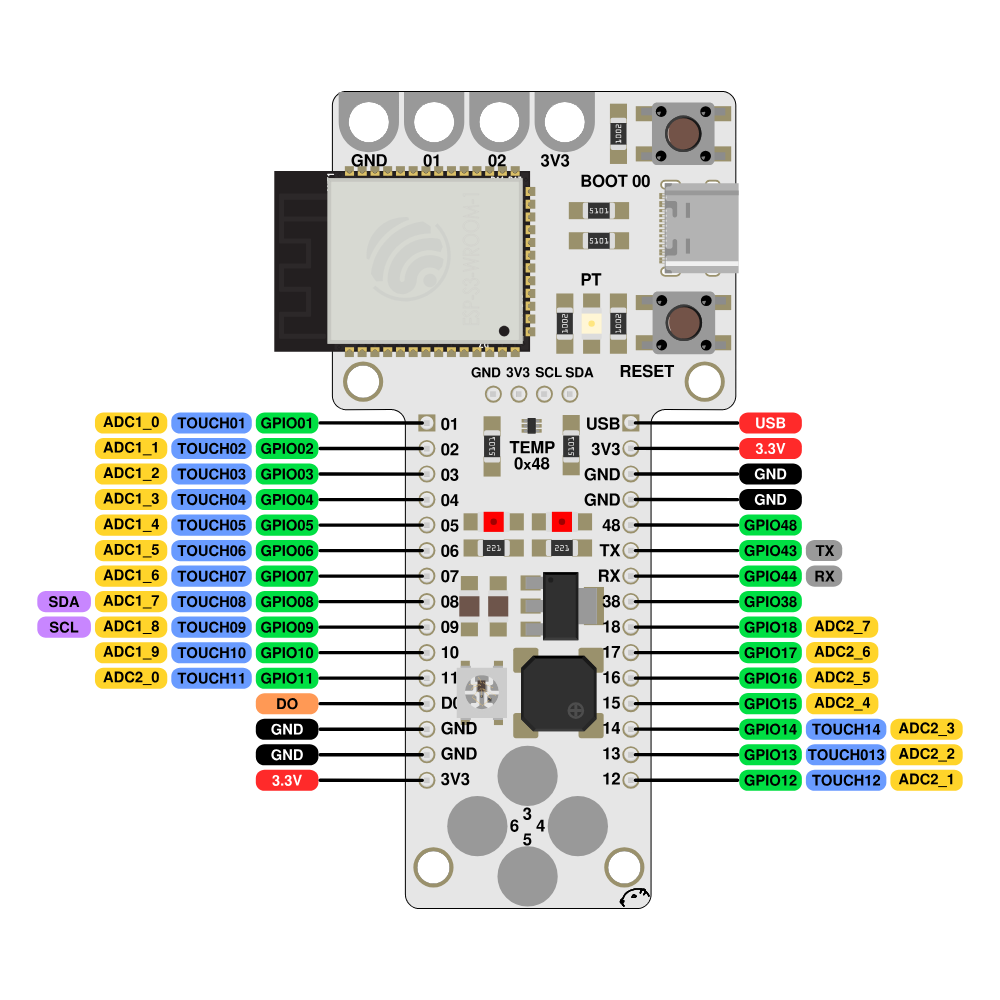
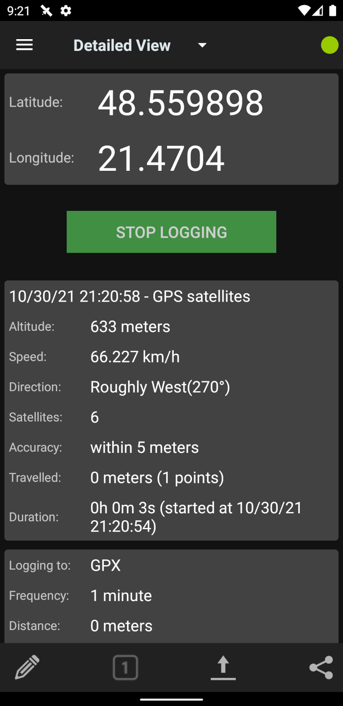
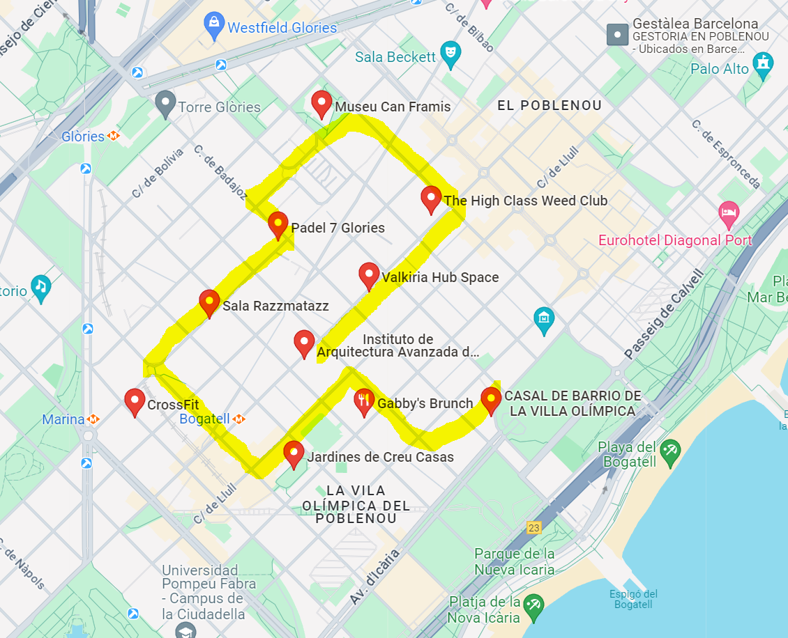
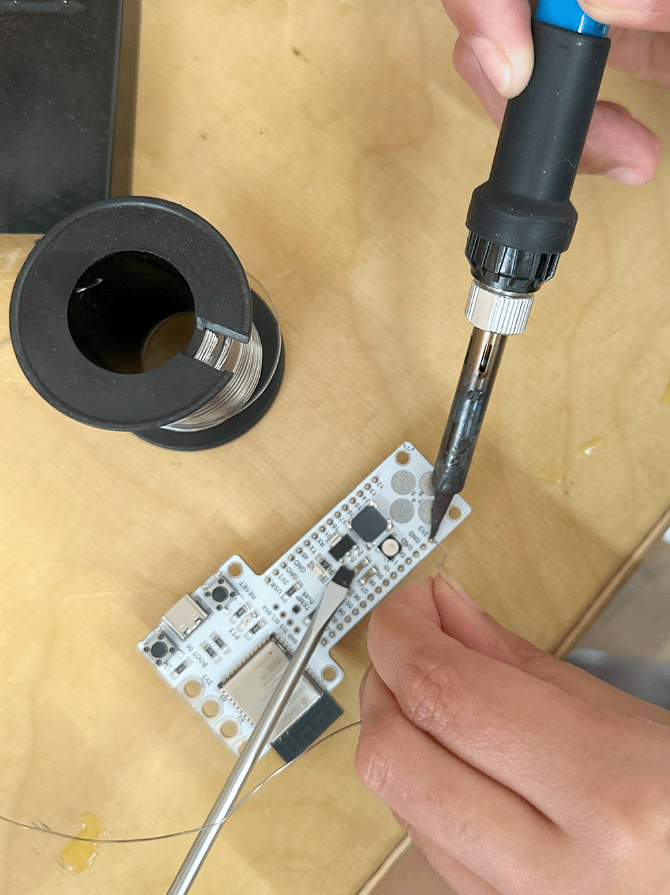
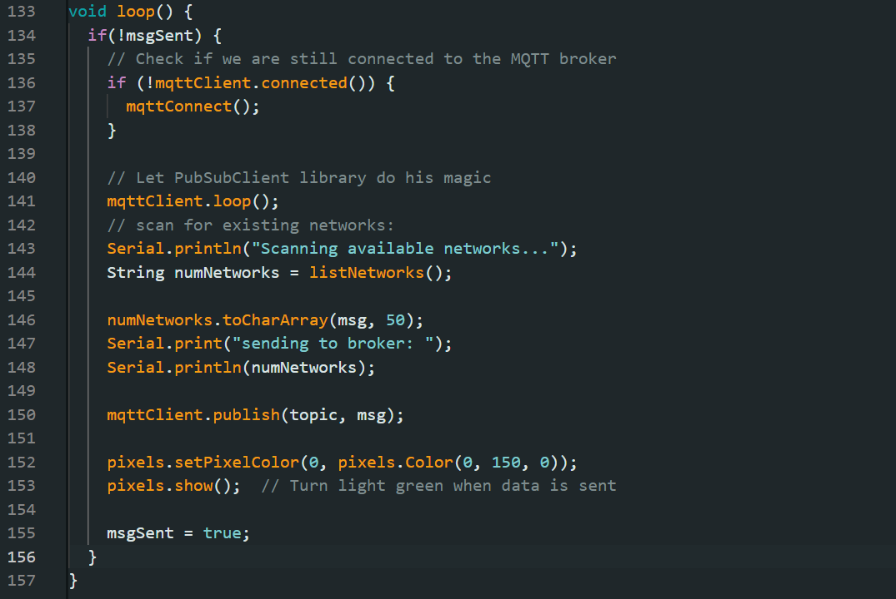
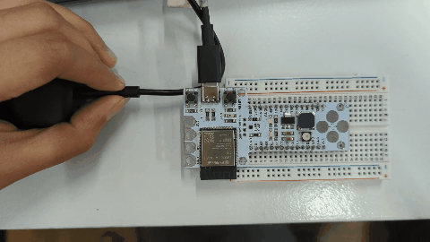

---
hide:
    - toc
---


!!! info "Measuring The World"
    ==FACULTY==: Oscar Gonzalez/ Adai Surinach
    
    ==CALENDAR==: 07/02/2024 - 09/02/2024

    ==TRACK==: Exploration

    ## [Class NOTEs: HACK MD :point_left:](https://hackmd.io/-79CqG_URs-MYaN1qdrmTA?view)


!!! quote
    <center>
    # **:sparkling_heart:I LOVE GEEK**:sparkling_heart:

    


!!! example "REAL G"
    !!! info ""
        <center>
        
        # **We want to be more :revolving_hearts:CONNECTED:revolving_hearts:**

        ### :tools:Tool:tools:: (B)arduino


        !!! note ""
            ## :nerd_face: Welcome to the **Real G Team:** 

            🧐: G stand for what? Gangstar?
        
            😇: NO! G stand for GEEK
    
            :heart:Qianyin Du:heart: Ana Lozano:heart:Jorge Muñoz:heart:Dhrishya Ramadass:heart:Emmanuelle Pangilinan:heart:
        </center>
        
    
    !!! example "Project Goals"

        !!! info ""
            > 💬_**Brainstorming Our Area of Interest**_💬

            <center>
            {: style="height:380px;width:480px"}
            </center>

            !!! note ""
                ### We define connectivity as shared spaces, whether physical or within cyberspace. Therefore, we decided to measure these common spaces by finding the different WiFi points in the Poblenou neighborhood. To detect the different WiFis in the neighborhood, we decided to use the Barduino.

        !!! info ""
            > 🕳️_**Leading Inquiry**_🕳️

            !!! note ""
                ### How does the availability of shared spaces, both physically and digitally, impact community connectivity and collaboration?

        !!! info ""
            > 🚨_**Objective**_🚨

            !!! note ""
                ### To detect  community connectivity and collaboration by assessing the accessibility and quality of shared spaces, both online and offline.

        !!! info ""
            > :question:_**Question(s)**_:question:
            
            !!! note ""

                ### 1. Are there more spaces to be connected?

                ### 2. Is it harder to be more connected?

        !!! info ""
            > 🌞_**Hypotesis**_🌞

            !!! note ""
                ### Our hypothesis is that by employing the Barduino to detect WiFi points in the Poblenou neighborhood and utilizing multiple reference points, we will uncover varying levels of connectivity within the area. We anticipate finding a diverse range of WiFi networks, including both open and password-protected networks, reflecting the diverse usage patterns and security practices of residents and businesses in the neighborhood. Additionally, we expect that certain locations will exhibit higher concentrations of active WiFi points, indicating areas of higher connectivity and potential community engagement.

        !!! info ""
            > 🖥️_**From hypotesis to Data**_🖥️

            !!! note ""
                ### Measurement of Connectivity in the Poblenou Neighborhood using **(B)arduino**:
                <center>
                {: style="height:380px;width:390px"}
        
        !!! info ""
            > :question:_**What is MQTT**_:question:

            !!! note ""

                ### MQTT is a lightweight, publish-subscribe, machine to machine network protocol for message queue/message queuing service. It is designed for connections with remote locations that have devices with resource constraints or limited network bandwidth, such as in the Internet of Things (IoT).
            
                <center>
                {: style="height:200px;width:370px"}
                {: style="height:350px;width:400px"}

        !!! info ""
            > :question:_**How it works**_:question:*
            
            !!! note ""

                > _**Logic sketch:**_

                <center>
                {: style="height:300px;width:250px"}

                
                ```mermaid
                graph LR

                Location --> PressButton  --> CollectData-- .txt/.csv -->SaveFile

                ```

                </center>

        !!! info ""
            > **📍*GPS*📍**
            !!! note ""
                ### Using a GPS module to record the geographical coordinates of each reference point along with the number of active WiFis present.

                ### To measure the location, we use  [GPS Logger](https://gpslogger.app/) to save location data to a GPX file.

                <center>
                {: style="height:300px;width:180px"}
                {: style="height:300px;width:180px"}
                </center>


                ### We transfer the GPX data to an Excel document, and then automatically place them on the map.

                ### At first, we chose different locations in Poblenou that we considered to be gathering spots and hubs of connectivity.

                ### Chosen sites: [Google Sheet](https://docs.google.com/spreadsheets/d/111GFvo0vGYvQlp7txalfSbmiVxKoMT-6N0aR0naJF_Q/edit#gid=0) :point_left:

                <center>
                {: style="height:300px;width:400px"}


                {: style="height:300px;width:400px"}

                > We took one picture with G(eek)-sign on each spot to document our succeed :smile_cat:

                </center>

        !!! info ""
            > 📐_**WIiFi signal measurement**_📐

            !!! note ""

                ### We used the [(B)arduino](https://fablabbcn-projects.gitlab.io/electronics/barduino-docs/GettingStarted/pinout/)  to scan and measure the amount of WiFi signal in the environment, detecting how many signals are open or closed.

                *welding our (B)arduino:* 

                {: style="height:300px;width:220px"}

        !!! info ""
            > ⚠️_**Development of code for Barduino:**_⚠️
            
            !!! note ""

                {: style="height:300px;width:400px"}
                {: style="height:300px;width:400px"}

                ### We used Barduino to find and count the available Wifi networks, and how many are open/have no password.

                ### The data is sent via the smart citizen MQTT Broker.

            ??? note "CODE"
                ```
                #include <WiFi.h>
                #include <PubSubClient.h>
                #include <Adafruit_NeoPixel.h>

                // Which pin on the Arduino is connected to the NeoPixels?
                #define PIN 38  // On Trinket or Gemma, suggest changing this to 1

                // How many NeoPixels are attached to the Arduino?
                #define NUMPIXELS 1  // Popular NeoPixel ring size

                // When setting up the NeoPixel library, we tell it how many pixels,
                // and which pin to use to send signals. Note that for older NeoPixel
                // strips you might need to change the third parameter -- see the
                // strandtest example for more information on possible values.
                Adafruit_NeoPixel pixels(NUMPIXELS, PIN, NEO_GRB + NEO_KHZ800);

                const char* ssid = "";
                const char* password = "";
                WiFiClient wifiClient;

                const char* mqttBroker = "mqtt-staging.smartcitizen.me";
                const char* mqttClientName = "futurehacker";
                const char* mqttUser = "fablabbcn102"; // MQTT User Authentification
                const char* mqttPass = ""; // MQTT Password Authentification
                const char* topic = "lab/mdef/realg";
                PubSubClient mqttClient(wifiClient);

                unsigned long values[] = {0,0,0,0};
                String direction[] = {"U","R","D","L"};

                String dir = "";

                unsigned long threshold = 40000;

                void mqttConnect() {
                
                while (!mqttClient.connected()) {
                
                    Serial.print("Attempting MQTT connection...");
                
                    if (mqttClient.connect(mqttClientName, mqttUser, mqttPass)) {
                
                    Serial.println("connected");
                    mqttClient.publish(topic, mqttClientName);
                    
                
                    } else {
                    
                    Serial.print("failed, rc=");
                    Serial.print(mqttClient.state());
                    Serial.println(" try again in 5 seconds");
                    delay(5000);
                    
                    }
                }
                }

                /*void callback(char* topic, byte* payload, unsigned int length) {
                String incommingMessage = "";
                for (int i = 0; i < length; i++){
                    incommingMessage += (char)payload[i];
                } 
                Serial.println("Message arrived[" + String(topic) + "]" + incommingMessage);
                }*/

                void setup() {
                
                Serial.begin(115200);
                Serial.println("Hello");
                pixels.begin();  // INITIALIZE NeoPixel strip object (REQUIRED)

                pixels.setPixelColor(0, pixels.Color(150, 0, 0));
                pixels.show();  // Send the updated pixel colors to the hardware.

                // Connect to wifi
                WiFi.mode(WIFI_STA);
                WiFi.begin(ssid, password);
                
                while (WiFi.status() != WL_CONNECTED) {
                    delay(500);
                    Serial.print(".");
                }
                
                Serial.print("Connected to ");
                Serial.println(ssid);
                Serial.print("IP address: ");
                Serial.println(WiFi.localIP());

                pixels.setPixelColor(0, pixels.Color(0, 0, 150));
                pixels.show();  // Send the updated pixel colors to the hardware.
                
                // MQTT setup
                mqttClient.setServer(mqttBroker, 1883);  
                }

                /*void loop() {
                // Check if we are still connected to the MQTT broker
                if (!mqttClient.connected()) {
                    mqttConnect();
                }

                // Let PubSubClient library do his magic
                mqttClient.loop();

                // Add your publish code here --------------------
                unsigned long max = 0;
                int max_i;
                for (int i=0; i<4; i++){
                    values[i] = touchRead(i+4);
                    //Serial.print(values[i]);
                    //Serial.print(",");
                    if (values[i] > max){
                    max = values[i];
                    max_i = i;
                    }
                }
                //Serial.println("");
                if (max > threshold && dir != direction[max_i]){
                    dir = direction[max_i];
                    Serial.println(dir);
                    mqttClient.publish(draw_topic, dir.c_str());
                }
                else if (max <= threshold){
                    dir="";
                }
                }*/

                char msg[50];
                bool msgSent = false;

                void loop() {
                if(!msgSent) {
                    // Check if we are still connected to the MQTT broker
                    if (!mqttClient.connected()) {
                    mqttConnect();
                    }

                    // Let PubSubClient library do his magic
                    mqttClient.loop();
                    // scan for existing networks:
                    Serial.println("Scanning available networks...");
                    String numNetworks = listNetworks();

                    numNetworks.toCharArray(msg, 50);
                    Serial.print("sending to broker: ");
                    Serial.println(numNetworks);

                    mqttClient.publish(topic, msg);

                    pixels.setPixelColor(0, pixels.Color(0, 150, 0));
                    pixels.show();  // Turn light green when data is sent

                    msgSent = true;
                }
                }

                String listNetworks() {
                int numFree = 0;
                // scan for nearby networks:
                Serial.println("** Scan Networks **");
                int numSsid = WiFi.scanNetworks();
                if (numSsid != -1) {
                    // print the list of networks seen:
                    Serial.print("number of available networks:");
                    Serial.println(numSsid);

                    // print the network number and name for each network found:
                    for (int thisNet = 0; thisNet < numSsid; thisNet++) {
                    Serial.print(thisNet);
                    Serial.print(") ");
                    Serial.print(WiFi.SSID(thisNet));
                    Serial.print("\tSignal: ");
                    Serial.print(WiFi.RSSI(thisNet));
                    Serial.print(" dBm");
                    Serial.print("\tEncryption: ");
                    Serial.println(WiFi.encryptionType(thisNet) ? 0: "Goodpeople");
                    if(WiFi.encryptionType(thisNet) == 0) {
                        numFree++;
                    }
                    //printEncryptionType(WiFi.encryptionType(thisNet));
                    }
                } 
                    //while (true);
                    return String(numSsid) + "," + String(numFree);
                }
                ```

        !!! info ""
            > 🛖_**Data storage:**_🛖

            !!! note ""

                {: style="height:300px;width:220px"}

                ### We used python to merge the metadata of the location of the reference points with the metadata of the active WiFi points, including information about which ones are open.

        !!! info ""
            >🌐_**Data receiving code:**_🌐

            !!! note ""
    
                ### While the barduino is sensing the data, we have a running python script that is subscribed to the same smart citizen broker so that we can "catch" the data in real-time.

                ### We then save it into a .csv file.

                ??? note "CODE"
                    ```
                    import paho.mqtt.client as mqtt
                    import time
                    import calendar
                    from datetime import datetime

                    current_GMT = time.gmtime()

                    mqtt_broker = "mqtt-staging.smartcitizen.me"
                    mqtt_user = "fablabbcn102"
                    mqtt_pass = ""
                    broker_port = 1883

                    def on_connect(client, userdata, flags, rc):
                    print(f"Connected With Result Code: {rc}")

                    def on_message(client, userdata, message): 
                    print(f"Message Recieved: {message.payload.decode()}")
                    time_stamp = calendar.timegm(current_GMT)
                    now = datetime.now() # current date and time
                    date_time = now.strftime("%m/%d/%Y, %H:%M:%S")
                    print("Current timestamp:", now)
                    # Do something here with the message

                    if(message.payload.decode() != "futurehacker"):
                        # Opening a file
                        file1 = open('myfile.csv', 'a')
                        file2 = open('myfile.txt', 'a')
                        newdata = message.payload.decode() + "," + date_time + "\n"
                    
                        # Writing a string to file
                        file1.write(newdata)
                        file2.write(newdata)

                        # Closing file
                        file1.close()
                        file2.close()


                    def on_log(client, obj, level, string):
                        print (string)

                    def read_sensor():
                        sensor_reading = "Hola hola caracola"
                        return sensor_reading

                    client = mqtt.Client(clean_session = True)
                    client.on_connect = on_connect
                    client.on_message = on_message
                    client.on_log = on_log
                    client.username_pw_set(username = mqtt_user, password = mqtt_pass)
                    client.connect(mqtt_broker, broker_port)


                    # Subscribe to your topic here
                    client.subscribe("lab/mdef/realg", qos=1)


                    # Start looping (non-blocking)
                    client.loop_start()

                    while True:
                        time.sleep(5)
                    ```
        !!! info ""
            > 🗺️_**Data Visualization:**_🗺️

            !!! note ""
                ### We developed an interface to visualize the collected data on a map. We used the Google Maps tool to create a visualization of the analyzed points.

                https://jmuozan.github.io/mdef-website/Code/Measuring_the_World/poblenou.html :point_left:

        !!! info ""
            > 💌_**References**_💌

            !!! note ""

                https://youtu.be/RWgyCcnUxPY?si=pwDouL_VC_-BcM-z 
                *Video Reference: How to Save Arduino Serial Data to .txt .csv*

                https://hackmd.io/i46Hmb2vTcKI6_DIoaxDvQ?view
                *GPS Mobile location* 

                https://gpslogger.app/ 

                https://www.geeksforgeeks.org/writing-to-file-in-python/
                *Writing to file in Python*

                https://www.programiz.com/python-programming/datetime/strftime#google_vignette
                *Strftime*

                https://flexiple.com/python/python-timestamp
                *Python-timestamp*

                https://gitlab.com/fablabbcn-projects
                *FablabBCN gitlab*

                https://opendata-ajuntament.barcelona.cat/es/
                *Open data*

        !!! info ""
            > _**Presentation**_ :smile_cat:

            !!! note ""
                <center>
                <iframe src="https://drive.google.com/file/d/1Rb2joF2-YkBfbxCBKD7cRbLNn-ycYf78/preview" width="640" height="480" allow="autoplay"></iframe>
                </center>

            > _**Check the full documents here**_ :point_right:[HACK MD](https://hackmd.io/@usaestoparadescargar/ryR2UAlsp)


!!! note "ClassNotes"
    > 02/07/2024

    # **DATA vs INFORMATION**
    :question: How do we collect the data and transform to a new **FORM**. 


    | DATA | INFORMATION | 
    |:-------- |:--------:|
    | Raw    |  processed   |
    | Disorganised    |   organised   |
    | no context, just facts |context, from facts
    | captured in various ways |derived from data
    | by different actors |by different actors
    | but without meaning in itself | with meaning|


    !!! note ""
        # Deductive: **Measuring the world**
        > Broad questions focus in observe analyse reason take decisions.
        **Data is only a part of the process**

        # Inductive: **Atlas of weak signal**
        > specific observation understand analyse pattern recognition general conclusion
        


    !!! note ""
        :book:BOOK: 
        
        [THe age of survellance capitalism- Shoshana Zuboff](https://en.wikipedia.org/wiki/The_Age_of_Surveillance_Capitalism)

        [Making Sense](https://docs.smartcitizen.me/)
    !!! note ""
        :black_joker:Vocabs:

        [Anonymous](https://en.wikipedia.org/wiki/Anonymous_(hacker_group))
    
