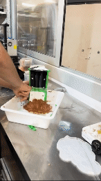
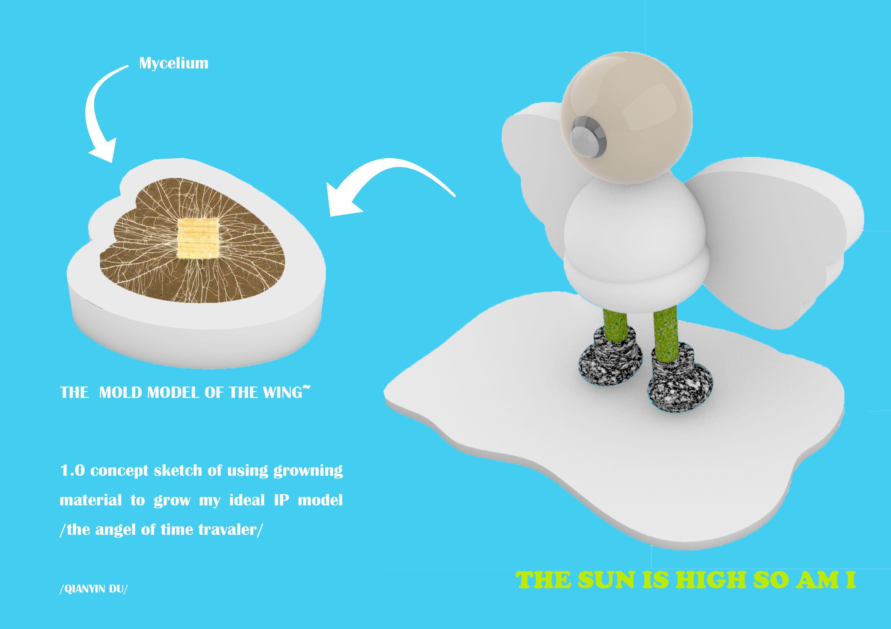

---
hide:
    - toc
---

!!! info "Task 02 Digital Prototying for Design"
    ==FACULTY==: Santiago Fuentemilla Garriga/ Josep Marti Elias/ Petra Garajová/ Adai Surinach

    ==CALENDAR==: 31/01/2024 

    ==TRACK==: Application

    ## [TASK02](https://fablabbcn-projects.gitlab.io/learning/educational-docs/tasks/task_module2/):point_left:

!!! info "How to make a Soft Robot"
    !!! abstract ""
        Big thanks to this amazing "digital professor" Rafarl Diaz [Gesture controlled soft robot tentacle](https://www.hackster.io/blight3d/gesture-controlled-soft-robot-tentacle-0b9f68)👈

        > Step 1: 3D print the mold

        {: style="height:300px;width:400px"}'
        {: style="height:300px;width:200px"}'

        > Step 2: Know and choose your Silicone

        {: style="height:300px;width:200px"}'

        !!! example ""
             * Recommandation store in Barcelona for Silicone
                
                [Formx](https://www.formx.es/)👈

        > Step 3: Concrete the facade to protect the Silicone

        {: style="height:300px;width:200px"}'

        > Step 4: Genteelly mix and pour the Silicone into the mold

        {: style="height:300px;width:200px"}'

        > Step 5: Result~

        {: style="height:300px;width:200px"}'

!!! abstract "ClassNotes"
    !!!note "Module 2 "
        01/31/24, 02/01/24

        [Solar Sinter Project](https://www.google.com/search?sca_esv=69a528ce899389b7&q=MARKUS+KAYSER+SOLAR+SINTER+PROJECT&sa=X&ved=2ahUKEwj1sMKWrYeEAxXfRKQEHexvDvkQ7xYoAHoECAgQAg&biw=1280&bih=664&dpr=2#fpstate=ive&vld=cid:82d17511,vid:ptUj8JRAYu8,st:0)

        [LOM](https://www.sculpteo.com/en/glossary/lom-definition/)(https://en.wikipedia.org/wiki/Laminated_object_manufacturing)

    !!!note "Bio-Grow"
        ## **clean!CLEAN LAB** :mask:

        [Bio Growing](https://fablabbcn-projects.gitlab.io/learning/educational-docs/mdef/classes/2024/growmaterials/)

        [plaster studio](http://www.theplastercollective.com/el-panamericano-1)
        
        > Side notes for Kombucha: ALWAYS test the ph#, usually the # of ph are between 3-4.

        

    !!! note "Experience the Mycelium"
        > The process pictures of making Mycelium with Annna and Everardo for our GAIA project

        .jpg){: style="height:300px;width:500px"}'
        {: style="height:300px;width:200px"}'

    !!! note "FOR FUTURE"
        

        {: style="height:500px;width:800px"}
