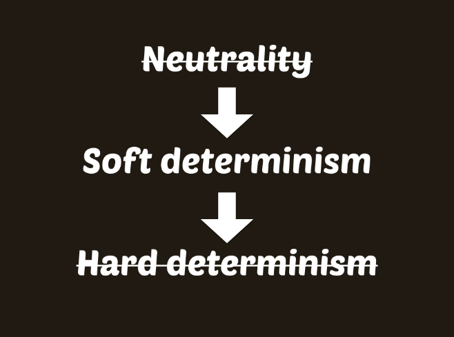

---
hide:
    - toc
---

!!! info "Design Ethics"
    ==FACULTY==: Ariel Guersenzvaig
    
    ==CALENDAR==: 16/04|23/04|2024

    ==TRACK==: Reflection

!!! quote
    

    {: style="height:350px;width:800px"}
    ## First, we have tools[^Stone-Age^], after we give intelligence to tools, it became Technology. - 33DUDU
    
    
!!! abstract "Notes"
    !!! example ""
        [Class Slides](https://www.dropbox.com/scl/fi/1wgp8okwql9ezuseg7ypg/1.-intro-philo-tech.pdf?rlkey=dr9supyshi7qfwhtlxzkqlp3y&e=1&dl=0)	👀👈

    !!! info "Day01|16/04/2024|"
        !!! quote ""
            🚨	We are not always conscious about technology, unless we mention it. 

        ??? quote "Technologies (i.e. artefacts) are practical implementations of intelligence."

            > Technologies, such as tools, devices, or systems, are tangible manifestations of human intelligence and problem-solving capabilities.

            > When humans develop technologies, they are applying their knowledge, creativity, and understanding of the world to create practical solutions to various challenges or needs. 
       
        !!! example "Book"
            [Existential Technics- _Don Ihde_ ](https://www.goodreads.com/en/book/show/6445999)

            [The real world of technology- _Ursula Franklin_ ](https://monoskop.org/images/5/58/Franklin_Ursula_The_Real_World_of_Technology_1990.pdf)

            [A Cyborg Manifesto- _Donna J. Haraway_ ](https://warwick.ac.uk/fac/arts/english/currentstudents/undergraduate/modules/fictionnownarrativemediaandtheoryinthe21stcentury/manifestly_haraway_----_a_cyborg_manifesto_science_technology_and_socialist-feminism_in_the_....pdf)

            [Moralizing Technology- _Peter-Paul Verbeek_](https://books.google.es/books/about/Moralizing_Technology.html?id=Falkge0XaxoC&source=kp_book_description&redir_esc=y)

            [Technology and the lifeworld-_Don Ihde_](https://books.google.es/books/about/Technology_and_the_Lifeworld.html?id=u2pRAAAAMAAJ&source=kp_book_description&redir_esc=y)
            
        !!! bug "2 opposed visions of technology"
    

            !!! question ""
                ## 1. Technological neutrality

                !!! quotes ""
                    ## Guns don't kill people; People kill people- _Joseph C. Pit_

                    > When people hold a gun, it become ==GUNMAN== hybraid. 
    
            !!! question ""
                ## 2. [Technological determinism _by Thorstein Veblen_](https://en.wikipedia.org/wiki/Technological_determinism)

                > Technological determinism" is a theory that suggests technology plays a crucial role in shaping society, culture, and human behavior. 
            
            

            {: style="height:150px;width:300px"} 
            {: style="height:150px;width:180px"}

        !!! bug "Relation"
            > Technologies co-shape our behaviour and our experience of the world. 

            {: style="height:150px;width:180px"}

            !!! question ""
                ## 1. Embodiment relation
                !!! example ""
                     - (Human- Technology)=World

                ??? bug "CHatGPT3.5" 
                    > This relationship refers to the idea that human experiences, perceptions, and understandings are deeply intertwined with the physical body. Embodiment emphasizes the significance of bodily sensations, movements, and interactions in shaping cognition, emotions, and social interactions. In various contexts, embodiment highlights the inseparable connection between the mind and the body, suggesting that our understanding of the world is fundamentally grounded in our bodily experiences.

            !!! quesion ""
                ## 2. Hermeneutic relation
                !!! example ""
                    - Human= (Technology-World)

                ??? bug "CHatGPT3.5" 
                    > The hermeneutic relationship involves the process of interpretation and understanding, particularly in the context of language, texts, and cultural artifacts. Hermeneutics is a philosophical approach that explores how meaning is constructed, conveyed, and interpreted through various forms of communication and expression. It emphasizes the importance of context, perspective, and dialogue in deciphering and making sense of complex phenomena, ranging from literary texts to social practices.

            !!! question ""
                ## 3. Alterity relations
                !!! example ""
                    - Human= Technology(- World)

                ??? bug "CHatGPT3.5" 
                    >  Alterity refers to the state of being "other" or different from oneself. In relationships of alterity, individuals or groups encounter and engage with entities or perspectives that are distinct from their own. Alterity highlights the diversity, multiplicity, and complexity of human experiences and identities, emphasizing the significance of recognizing and respecting difference. It invites reflection on the dynamics of power, privilege, and marginalization in interactions between self and other.
                    
            !!! question ""
                ## 4. Background relations
                !!! example ""
                    - Human(-Technology-World)

                ??? bug "CHatGPT3.5" 
                    >  The background relationship pertains to the broader socio-cultural context within which individuals and events are situated. Background encompasses the norms, values, institutions, and historical legacies that shape human experiences and behaviors. It provides a framework for understanding the conditions and influences that contribute to the formation of identities, beliefs, and social structures. Attention to background highlights the interconnectedness of individual lives with larger systems and forces operating in society.

            !!! question ""
                ## 5. Cyborg relations
                !!! example ""
                    - (Human/Technology)=World

                ??? bug "CHatGPT3.5" 
                    >  The cyborg relationship involves the fusion or interaction between humans and technology, blurring the boundaries between organic and artificial entities. Cyborgs, short for cybernetic organisms, symbolize the integration of human bodies with technological enhancements or prosthetics, as well as the increasing interconnectedness between humans and digital technologies. The concept of the cyborg raises questions about identity, agency, and embodiment in technologically mediated environments, challenging traditional notions of human nature and subjectivity.

    !!! info "Day02|23/04/2024|"

        ??? note "Mutability"
            "Mutability" refers to the quality of being liable or prone to change. It suggests a state of being variable or changeable, often in response to external influences or internal processes. In various contexts, mutability can refer to the capacity of something to be altered, transformed, or adapted over time.

        ??? note "Technologies are multistable"
            Technologies can exist in multiple stable states or configurations. This means that a single technology can have various uses, applications, or interpretations depending on the context in which it is employed or the perspective from which it is viewed.
    
        ??? note "Jevon's paradox"
            Jevons's Paradox, named after the 19th-century economist William Stanley Jevons, refers to the phenomenon where an increase in the efficiency of resource use (such as energy or fuel) leads to an overall increase in consumption of that resource rather than a decrease. In other words, as technology improves and makes it more efficient to use a resource, the total consumption of that resource may actually rise rather than fall, because the lowered cost or increased availability encourages greater use. This paradox highlights the complex relationship between technological advancement, resource efficiency, and overall resource consumption.

        !!! bug ""
            Stabilities and their effects are not easy to predict. Technology responds to social forces.

        !!! bug ""
            Design materialises notions of the good and the right.

        !!! abstract ""
            > Design for Socially Responsible Behavior: A Classification of Influence Based on Intended User Experience

            {: style="height:350px;width:800px"}

        !!! bug ""
            Ethics is about discerning how we should live and what is means to live a good life

        1. Deco

            ??? abstract "First CI"
                Act only according to that maxim whereby you can at the same time will that it should become a universal law.

            ??? abstract "Second CI:"
                Act in such a ay that you treat humanity, whether in your own person or in the person of any other, never merely as a means to an end, but always at the same time as an end.

            * Case: Compas

        2. Consequentialism
        
            !!! bug ""
                Ethics of effects.

                utilitarianism is the most commonly applies ethical theory.

            ??? abstract "Jeremy Bentham- Panopticon"

                The Panopticon theory holds that people can be controlled when they believe themselves to be under constant surveillance even if no one is watching. The theory stems from the intended effect of having a central guard tower in a prison that all the prisoners could see, even though they could not see the guards.

            ??? abstract "Maximize happiness"
                the greatest amount of good for the greatest number.

            !!! abstract ""
                AI benefits and harms 

                > [Michael Schwarz, Microsoft VP at the World economic Forum. ](https://www.youtube.com/watch?v=Tp95fJo74b4)
        
        3. Virtue ethics
            |Aristoe| Anscombe| Maclntyre

            ??? abstract "virtue ethics"

                Perspective focused on character, not rules or consequences. 
        
                A virtue is a good character trait that causes good ethical habits, benefitting the indibidual and wider society.

                An action is right and good if it would be dine by a virtuous person acting in character. 

        4. Care ethics

            ??? abstract " Care ethics"

                Action which is caring towards those who are vulnerale or need supporrt. Care is a transformative force.

                Care ethics emphasizes the importance of interpersonal relationships, context, and the interdependence of individuals. It foregrounds the moral significance of caring relationships and the responsibilities that arise within them. 
        
        5. Sumak Kawsay

            ??? abstract "Sumak Kawsay"

                Quechua for Good living/ Buen vivir.

                Alternative to the Western notion development, which is extractive and neo-colonialist.

                The subject of wellbeing is not the individual, but the individual in the social context of a community in a specific ime and environmental situation. 

                Gudynas: buen vivir is equally influenced by indigenous world views as by western critiques of capitalism (esp feminist thought and enviromentalism).

                "It certainly doesn't require a return to some sort of indigenous, pre- Colombian past."

                Some approaches are more adequate than others as they have trouble incorporating technologies' mediating role.

!!! note "Artefact"

    !!! question ""
        :question: What is Sex toy?

        !!! bug ""
            🤣[ChatGPT 3.5]:

            Sex toys are devices or objects designed to enhance sexual pleasure and intimacy. They come in a wide variety of shapes, sizes, and functions, catering to different preferences and desires. Some common types of sex toys include vibrators, dildos, anal plugs, masturbators, bondage gear, and sensory stimulation tools like feathers or blindfolds. People use sex toys for solo play, as well as with partners, to explore their bodies, enhance arousal, and add variety to sexual experiences.

        :question: What is Vibrator?
        !!! bug ""
            A vibrator, sometimes described as a massager, is a sex toy that is used on the body to produce pleasurable sexual stimulation. 
    1. Explore the Mediation of Experience phenomenologically:

        > Analyze how the artefact mediates human actions nad perceptions. Consider how it changes the way users perceive, and engage with the world.

        !!! bug "Vibrators"
            A vibrator mediates human actions and perceptions primarily by transforming sensory experiences and intimate interactions. Phenomenologically, this device changes the way users perceive and engage with their own bodies and potentially with partners. It enhances sensory experiences, providing a new form of pleasure that may not be achievable through traditional means. It also alters users' understanding of sexual fulfillment and intimacy, potentially expanding their perception of pleasure beyond physical interaction to include technological facilitation.

    2. Identify one or more relevant Human- Technology Relations:

        !!! bug ""
            2.1. embodiment
            > The vibrator acts as an extension of the body’s sensory capabilities. Users often view it as part of their intimate experiences, facilitating a personal connection that is physically external yet experientially integrated.

        !!! bug ""

            2.2. hermeneutic
            >  The vibrator serves as a medium through which individuals interpret and understand sensations differently. It mediates the experience of pleasure, offering a new 'language' or means of decoding bodily feelings.

        !!! bug ""
            2.3. alterity
            > The device can be seen as an 'other' in the context of personal or shared intimate experiences. It plays a distinct role in the sexual act, separate from human partners, often introducing a new dynamic to relationships and self-exploration.

    
        !!! bug ""
            2.4. background
            > Vibrators operate in the background of societal discussions about sexuality, often influencing norms and expectations quietly. Their presence and use reflect and can shift cultural understandings and taboos surrounding sexual wellness.
            
            It may require 2 human ??? in this situation??

        !!! bug ""
            2.5. cyborg
            >In a broader interpretation, regular use of a vibrator can lead to a cyborg-like relationship where human sexual experience and response are intertwined with technology, affecting how pleasure is experienced and expected.

    

    3. Analyse the mediation of experience ethically:

        > Explore any moral or ethical dimensions the artefact mediates. COnsider how it shapes human actions, decisions, and ethical considerations. What balues are inscribed and excluded in the artefact.

        !!! bug ""
            The ethical dimensions of vibrator use include considerations of privacy, autonomy, and the normalization of sexual wellness tools. These devices can empower users by providing control over their sexual experiences and pleasure, promoting a sense of autonomy and self-awareness. However, they also raise questions about dependency, the potential for isolation from human intimacy, and the commodification of personal pleasure. Moreover, the design and marketing of vibrators can reflect and perpetuate certain body images and sexual standards, potentially marginalizing non-normative sexual expressions and identities.

    4. Contextualize in Society

        > Discuss the broader societal implications of the artefact's mediation. Consider cultural, social, and possibly political dimensions of its use and integration into daily life short-term and long-term. What wil or could change?

        !!! bug ""
            Vibrators have played a significant role in the destigmatization of female sexuality and masturbation. They are increasingly discussed in the context of health and well-being rather than solely in moral or hedonistic terms. Socially, their acceptance speaks to broader shifts toward individual liberty and the recognition of sexual health as part of overall well-being.

    5. Summarize three key points of yur analysise and present. 

        !!! bug ""
            In summary, vibrators mediate human experiences by enhancing sensory perception, providing new modalities for pleasure, and challenging traditional norms around sexuality. They embody complex relationships between humans and technology, reflecting broader societal shifts towards acceptance and understanding of sexual wellness. Ethically, they promote autonomy but also raise questions about the implications of technological dependency in intimate areas of life. Vibrators, therefore, are not just personal pleasure devices but are significant artefacts with profound societal implications.
        > + Self cleaning system 🙃

    !!! example "Reference"
        [What is Sex Toys](https://www.plannedparenthood.org/learn/sex-pleasure-and-sexual-dysfunction/sex-and-pleasure/sex-toys)

        [Wiki-Vibrator](https://en.wikipedia.org/wiki/Vibrator_(sex_toy))