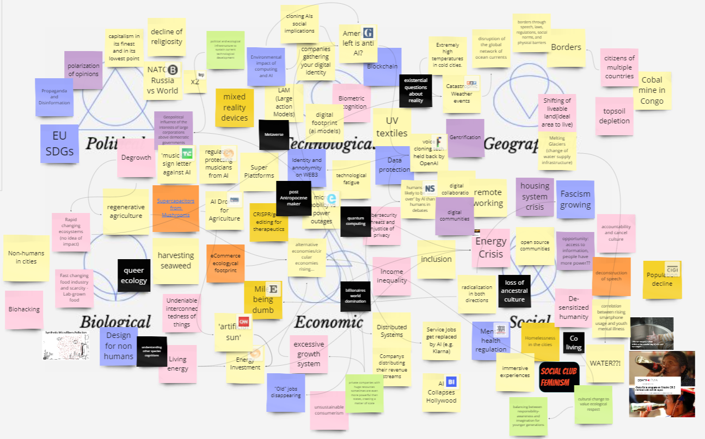
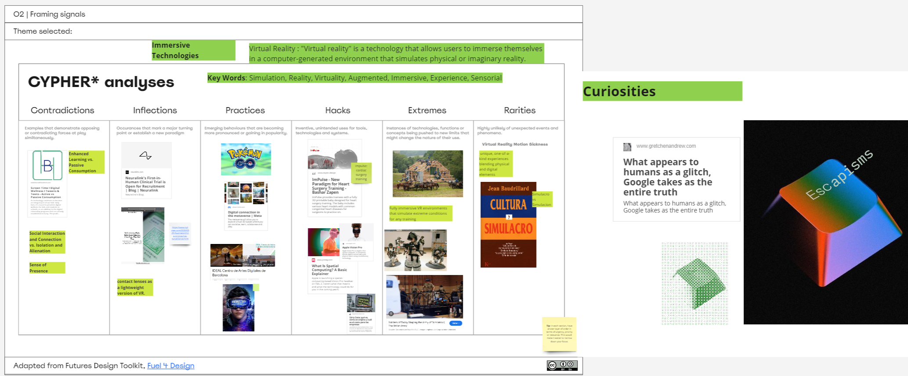
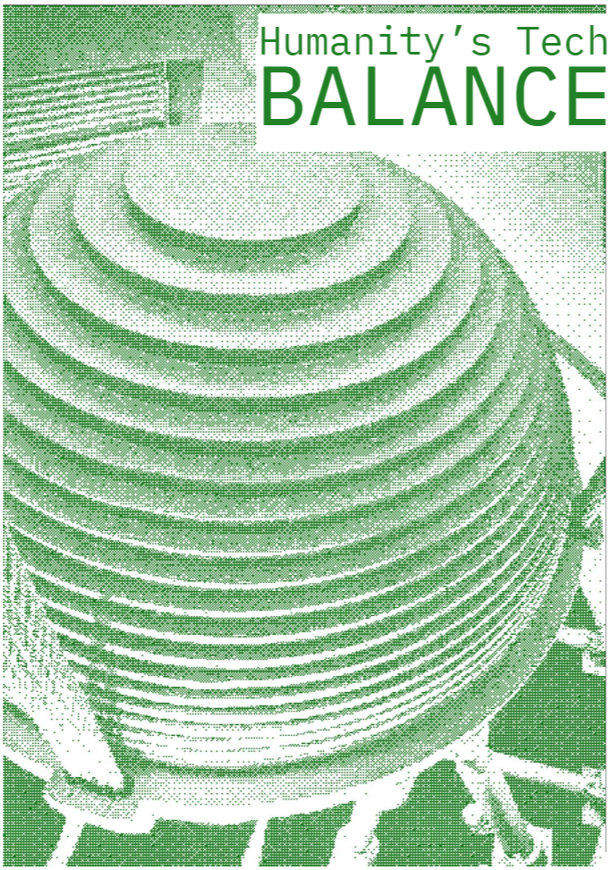

---
hide:
    - toc
---

!!! info "The Atlas of Weak Signals"
    ==FACULTY==: Jessica Guy|Olga Trevisan
    
    ==CALENDAR==: 03/04|2024

    ==TRACK==: Exploration

!!! quote
    

    ## 🕳️How many people nowadays can still find their direction and know the time without using electronic assistance?🕳️
    
    
!!! abstract "Notes"
    !!! info ""
        ## WORLDHOOD
        
        > date,time,location:
        
        !!! note "" 
            BARCELONA, 3 April 2024, 3rd floor of a dusty building, 3rd terms of our master, we are in a drought (back and forward of weather in these days, sun and rain, and sun again), uncertainty of a WW3, sunny morning, more silence (no constructions!!), election year in many countries, just came back from the research trip, love between each other, concerns about humanity and how it relates with the refugee and the palestina, school shooting, earthquake, hostage situation in the Netherlands and assassination of elective candidates in Mexico, neuralink implanting chips in human brains, a genocide happening while the west is watching, spring has come.

        {: style="height:400px;width:700px"}

    !!! info ""
        ## THEME SELECTED

        > Team members: Dudu, Annna, Jorge Muñoz, Vania, Carmen

        !!! note ""
            VIRTUAL WORLD vs. "REAL" WORLD

        {: style="height:400px;width:780px"}

    !!! info ""
        ## CYPHER* analyses
        > Theme selected: Immersive Technologies

        !!! note ""
            - Key Words: Simulation, Reality, Virtuality, Augmented, Immersive, Experience, Sensorial

        {: style="height:400px;width:800px"}

    !!! info ""
        ## New Atlas Of Weak Signals
        > Create protoyupes of our theme and connected weak signals.

        !!! note ""
            - Redefining Realities 
        {: style="height:400px;width:700px"}

    !!! info ""
        ## Collecting& Combining Theme
        > Collaboratively assess and review the empty areas of the circle, discuss if there are signals that can be added to create balance.

        !!! note ""
            - Humanity's Tech BALANCE

            

            {: style="height:400px;width:280px"}
            {: style="height:400px;width:430px"}

            > I'd like to start with the background graphic of this card. The background depicts the tuned mass damper sphere within Taipei 101. It's a crucial technology that helps balance the building's height and mitigate the impact of wind forces, especially in tall structures. The creation of this card coincided with Taiwan experiencing a 7.3 magnitude earthquake, prompting me to contemplate further. Through this natural disaster, we delve deeper into considering the balance between the realities and virtual realities of today's society. While an earthquake may be merely a fantasy in the virtual world, it's an inevitable disaster in reality. Therefore, this card aims to awaken people's climate consciousness and spark reflection on the balance between humanity and technology.

            > In the era of WEB 3.0 & 4.0, maintaining a balance between humanity and technology is paramount. Some argue that machine rights should not surpass those of humans. For example, in the real world, people may feel lost without technology, and time serves as a prime illustration. Only through technology, such as electronic screens, do people become aware of the existence of time, which might simply be a series of numbers. Therefore, we need to recognize that while technology brings convenience, we also need to strike a balance between humanity and technology to avoid losing touch with the real world."

            {: style="height:400px;width:5s00px"}

!!! example "Reference"
    [Taiwan 101tunned mass damper](https://www.ncree.org/SafeHome/ncr05/pc2_5.htm)
